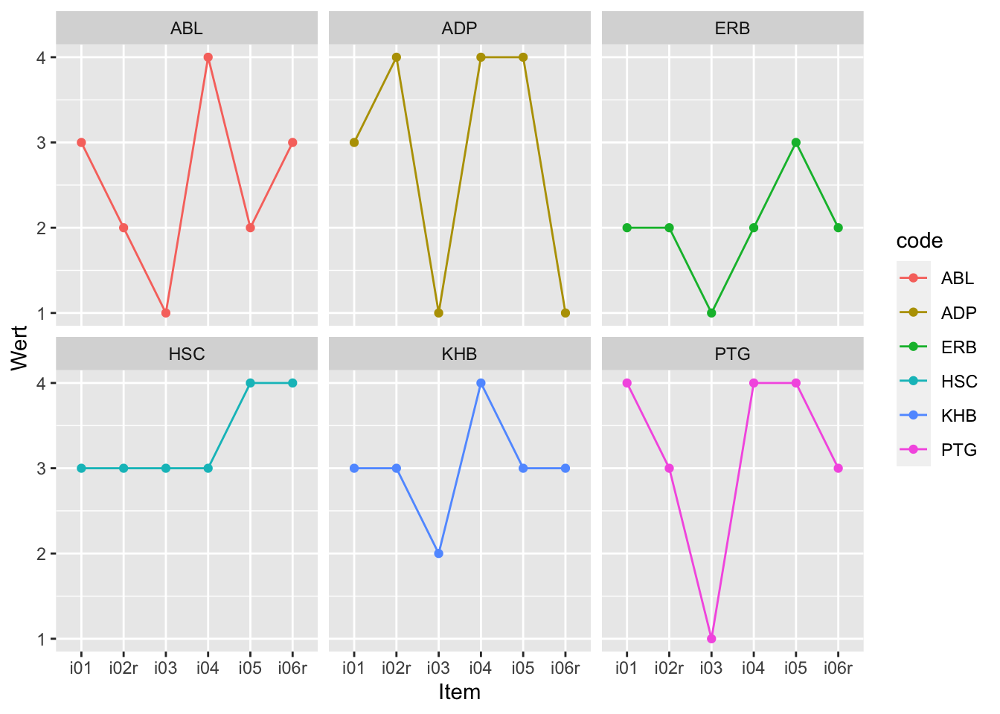
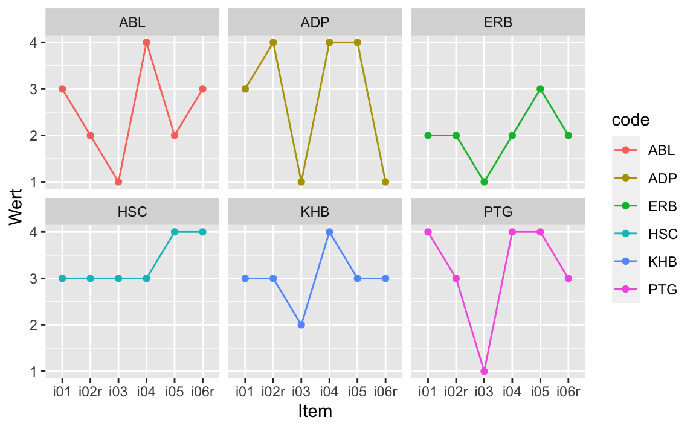

# Daten aufräumen


## R-Pakete


In diesem Kapitel benötigen wir folgende R-Pakete:


```r
library(tidyverse)  # Datenjudo
library(sjmisc)  # recode
library(ggstatsplot)  # Diagram aufbügeln
library(mice)  # Fehlende Werte ersetzen
```


## Daten


 

```r
data_url <- "https://raw.githubusercontent.com/sebastiansauer/modar/master/datasets/extra.csv"
extra <- read_csv(data_url)
```


## Überblick


Häufig sind Daten noch nicht "aufbereitet" und müssen noch "geputzt" oder "aufgeräumt" werden. Dazu gehören Schritte wie

- Daten umkodieren
- Daten aggregieren
- Daten gruppieren
- Fehlende Werte ersetzen
- Datenqualität prüfen
- Verteilungsformen prüfen
- Ausreißer behandeln

Betrachten wir einige zentrale Aspekte dieser Schritte.


## Brave Daten

Wie muss eine Tabelle gestaltet sein,
damit man sie gut in R importieren kann, bzw. gut damit weiterarbeiten kann?

[Das ist eine gute Quelle](https://www.tandfonline.com/doi/full/10.1080/00031305.2017.1375989) zu diesem Thema.

Im Überblick sollten Sie auf Folgendes achten:

- Wenn Sie händisch Daten eintragen, hacken Sie das einfach in Excel sein.
- CSV-Dateien bieten sich als Datenformat an.
- Alternativ kann man auch Excel-Dateien in R importieren.
- Es muss genau eine Kopfzeile geben.
- Es darf keine Lücken geben (leere Zeilen oder Spalten oder Zellen).
- Vermeiden Sie Umlaute und Leerzeichen in den Variablennamen.


Beachten Sie das Prinzip von "tidy data":

- In jeder Zeile steht *eine Beobachtung*.
- In jeder Spalte steht *eine Variable*.
- In jeder Zelle steht *eine Wert*.


## Text in Zahlen umwandeln


### Hilfe, ich habe keine Zahlen

Kennen Sie das? Sie haben eine Umfrage durchgeführt, Daten sind erhoben, puh, bald können Sie das Projekt abschließen.

Jetzt haben Sie die Daten in R importiert,
aber müssen zu Ihrem Schrecken feststellen,
dass die Spalten (Variablen) die eigentlich Zahlen sein sollten, 
als `character`, Text also, formatiert sind in R.

Anstelle der Zahl `5` steht in der Spalte also `"5"` (man beachte die Anführungszeichen, die anzeigen, dass es sich um einen Text handelt).

Na toll.

Mit Wörtern (Text) kann man nicht rechnen, und Sie rechnen doch so gern...

R weigert sich standhaft, mit Text zu rechnen:


```r
"5" + "5"
#> Error in "5" + "5": non-numeric argument to binary operator
```

Hätten wir brave Zahlen, wäre alles paletti:


```r
5+5
#> [1] 10
```

Der Einfachheit halber erzeugen wir uns eine einfache Tabelle, mit ein paar Spalten,
die *als Text* formatierte Zahlen enthalten:


```r
library(tidyverse)

d <- tibble(i01 = c("1", "3", "4"),  # von 1 bis 4
            i02 = c("-2", "+3", "-1"),  # von -3 bis -3
            i03 = factor(c("-2", "+2", "-1")))  # als Faktorvariable formatiert
d
#> # A tibble: 3 × 3
#>   i01   i02   i03  
#>   <chr> <chr> <fct>
#> 1 1     -2    -2   
#> 2 3     +3    +2   
#> 3 4     -1    -1
```

Für diejenigen, die kompliziert mögen, ist hier noch eine `factor`-Spalte hinzugefügt. Erstmal ignorieren.

Stellen Sie sich vor, die Tabelle ist ein Auszug aus Ihrer Umfrage,
wobei `i01` das erste Item (Frage) Ihres Fragebogens darstellt etc.


Wie kann man R beibringen, 
dass die fraglichen Spalte `i01` doch "in Wirklichkeit" Zahlen sind und kein Text?

Welcher R-Befehl hilft hier? 

### Introducing `parse_number()`

`parse_number()` (aus `{tidyverse}`) löst das Problem für Sie:


```r
d2 <- 
  d %>% 
  mutate(i01 = parse_number(i01))
d
#> # A tibble: 3 × 3
#>   i01   i02   i03  
#>   <chr> <chr> <fct>
#> 1 1     -2    -2   
#> 2 3     +3    +2   
#> 3 4     -1    -1
```

So würde es *in einigen Fällen* auch gehen:


```r
d %>% mutate(i01_r = as.numeric(i01))
#> # A tibble: 3 × 4
#>   i01   i02   i03   i01_r
#>   <chr> <chr> <fct> <dbl>
#> 1 1     -2    -2        1
#> 2 3     +3    +2        3
#> 3 4     -1    -1        4
```

Aber wenn `i01` als `factor()` formatiert ist, dann geht es nicht unbedingt.


```r
d %>% mutate(i02_r = as.numeric(factor(i02)))
#> # A tibble: 3 × 4
#>   i01   i02   i03   i02_r
#>   <chr> <chr> <fct> <dbl>
#> 1 1     -2    -2        2
#> 2 3     +3    +2        3
#> 3 4     -1    -1        1
```
Hoppla! Die Zahlen passen nicht!

`parse_number()` verlangt als Input `character`,
so dass Sie ggf. noch von `factor` auf `character` umformatieren müssen.


```r
d %>% mutate(i03_r = parse_number(as.character(i03)))
#> # A tibble: 3 × 4
#>   i01   i02   i03   i03_r
#>   <chr> <chr> <fct> <dbl>
#> 1 1     -2    -2       -2
#> 2 3     +3    +2        2
#> 3 4     -1    -1       -1
```


<!-- ## Daten umkodieren  -->

<!-- In einer Fragebogenstudie (oder vergleichbarer Studie) liegen in der Regel pro Respondent (allgemeiner: pro Beobachtung) eine Reihe von Antworten auf Fragebogen-Items vor.  -->
<!-- Manchmal liegen die Antworten noch nicht als Zahl vor, sondern als Text, etwa "stimme eher zu".  -->
<!-- Diese Antwort könnte auf einer vierstufigen Skala einer 3 entsprechen. Eine einfache Möglichkeit zum Umkodieren eröffnet das Paket `sjmisc`.  -->
<!-- Als Beispielaufgabe soll der Wert "Frau" in 1 umkodiert werden und "Mann" in 0; übrige Werte sollen in `NA` kodiert werden. -->

<!-- ```{r} -->
<!-- data_rec <- extra %>%  -->
<!--   rec(sex, rec = "Frau = 1; Mann = 0; else = NA") -->
<!-- ``` -->

<!-- Dabei wird eine neue Variable (Spalte) erzeugt, deren Namen der alten Variable entspricht, plus dem Suffix `_r`, in diesem Fall also `sex_r`. Man beachte, dass Textwerte (Strings) *nicht* in Anführungsstriche gesetzt werden müssen, nur der ganze "Rekodierungsterm" muss einmal in Anführungsstriche gesetzt werden. -->

<!-- Prüfen wir das Ergebnis: -->

<!-- ```{r} -->
<!-- data_rec %>%  -->
<!--   count(sex_r) -->
<!-- ``` -->


## Items umkodieren

In Fragebogen werden immer wieder Items *negativ* kodiert. Das bedeutet, dass sie gegenteilig zum messenden Konstrukt formuliert sind. Ist das Konstrukt Extraversion, so würde ein negatives Item im Sinne von Introversion kodiert sein. Ein Beispiel-Item für negative Kodierung wäre: "Ich bin ein Couch-Potato" oder "Ich bleibe am liebsten alleine zuhause."

Zuerst müssen wir die Anzahl der Antwortstufen wissen; diese Information findet sich in der Dokumentation der Skala (im "Manual" auch "Testdokumentation" oder "Benutzerhandbuch" genannt). Natürlich kann man prüfen, welche Antwortstufen die Respondenten gefunden haben, aber man wäre nicht sicher, ob auch alle möglichen Antworten ausgeschöpft wurden.

Im vorliegenden Fall ist der Dokumentation des Instruments zu entnehmen, dass jedes Item vier Antwortstufen (Likertformat) aufweist. Likert-skalierte Items zeichnen sich dadurch aus, dass sie so formuliert sind, dass höhere Werte in der Antwortstufe mit höherer Ausprägung des zu messenden Konstrukts einher gehen.  

Beim Umkodieren wird das Item "auf den Kopf gestellt": Der höchste Wert wird der kleinste, der zwei kleinste wird der zweitgrößte und so weiter. Im Schema sieht dies so aus:
  
  
```
1 --> 4
2 --> 3
3 --> 2
4 --> 1
```


Zum Umkodieren negativ kodierter Items bietet sich wieder die Funktion `rec` aus `sjmisc`.


```r
extra %>% 
  rec(i02r, rec = "1=4; 2=3; 3=2; 4=1")
```

In diesem Fall ist das Item `i02r` bereits umkodiert - genau wie alle Items im Datensatz die mit dem Suffix `r` gekennzeichnet sind. In anderen Situationen kann es aber nötig sein, Items umzukodieren. Vergessen Sie dann nicht, das Ergebnis als (neuen) Datensatz zu speichern.

Übrigens macht es `rec()` noch einfacher und zwar mit dem Parameterwert "rev" (wie *revert*):
  

```r
extra %>% 
  rec(i02r, rec = "rev")
```


Wenn Sie mehrere Items auswählen wollen,
benutzen Sie das *tidyselect*-Prinzip:
Also einfach die Spalten ohne Anführungszeichen per Komma (oder `:`) hintereinander aufführen:


```r
extra %>% 
  rec(i02r, i06r, rec= "rev")
#> # A tibble: 826 × 36
#>    timestamp code    i01  i02r   i03   i04   i05  i06r   i07
#>    <chr>     <chr> <dbl> <dbl> <dbl> <dbl> <dbl> <dbl> <dbl>
#>  1 11.03.20… HSC       3     3     3     3     4     4     3
#>  2 11.03.20… ERB       2     2     1     2     3     2     2
#>  3 11.03.20… ADP       3     4     1     4     4     1     3
#>  4 11.03.20… KHB       3     3     2     4     3     3     3
#>  5 11.03.20… PTG       4     3     1     4     4     3     4
#>  6 11.03.20… ABL       3     2     1     4     2     3     4
#>  7 11.03.20… ber       4     4     1     3     3     3     2
#>  8 11.03.20… hph       3     3     2     3     2     2     3
#>  9 11.03.20… IHW       4     4     1     4     3     4     3
#> 10 11.03.20… LEI       4     4     2     4     3     3     3
#> # … with 816 more rows, and 27 more variables: i08 <dbl>,
#> #   i09 <dbl>, i10 <dbl>, n_facebook_friends <dbl>,
#> #   n_hangover <dbl>, age <dbl>, sex <chr>,
#> #   extra_single_item <dbl>, time_conversation <dbl>,
#> #   presentation <chr>, n_party <dbl>, clients <chr>,
#> #   extra_vignette <chr>, i21 <lgl>, extra_vignette2 <dbl>,
#> #   major <chr>, smoker <chr>, sleep_week <dbl>, …
```


## Item-Labels in Zahlen umwandeln


Eine ähnliche Sache wie das Umpolen von Items ist folgende Situation: Ihre Umfrage-Software spuckt als Item-Antworten die "Ankertexte" oder "Itemlabels" aus wie *stimme überhaupt nicht zu* oder *stimme voll und ganz zu*.
Da man bekanntlich (höchstens) mit Zahlen aber nicht mit Texten rechnen kann,
möchten Sie diese Itemlabels in Zahlen umwandeln.
Das sieht dann ähnlich zu folgendem Wenn-Dann-Regel-Schema aus:

  
```
stimme voll und ganz zu --> 4
stimme eher zu --> 3
stimme eher nicht zu--> 2
stimme überhaupt nicht zu --> 1
```

Dieses Umwandeln können Sie  mit `case_when()` vornehmen.
`case_when()` listet einfach Wenn-Dann-Regeln auf.

Erzeugen wir uns mal ein paar Daten, 
um die Sache zu illustrieren:


```r
d <-
  tibble(person_nr = 1:3,
         i01 = c("stimme überhaupt nicht zu", "stimmer eher zu", "stimme voll und ganz zu"))
```

So ähnlich würden also Ihre Daten aussehen.

Jetzt zum Umwandeln:


```r
d %>% 
  mutate(i01_r = case_when(
    i01 == "stimme überhaupt nicht zu" ~ 1,
    i01 == "stimmer eher nicht zu" ~ 2,
    i01 == "stimme eher zu" ~3,
    i01 == "stimme voll und ganz zu" ~ 4
  ))
#> # A tibble: 3 × 3
#>   person_nr i01                       i01_r
#>       <int> <chr>                     <dbl>
#> 1         1 stimme überhaupt nicht zu     1
#> 2         2 stimmer eher zu              NA
#> 3         3 stimme voll und ganz zu       4
```

Die Syntax von `case_when()` lautet:

```
case_when(Prüfung ~ Konsequenz,
          Prüfung2 ~ Konsequenz)
```

Wenn `Prüfung` erfüllt ist (`TRUE`), dann wird `Konseequenz` ausgeführt.
Ansosten wird auf `Prüfung2` getestet, etc.


Alternativ könnte man auch `rec()` aus `sjmisc` nutzen.


## Zeilen (Fälle) löschen

In jeder braven Tabelle steht pro Zeile (genau) ein Fall;
mit "Fall", auch als "Beobachtung" bezeichnet, ist ein Untersuchungsobjekt gemeint.
Häufig sind das in der Psychologie Personen, es könnten aber auch z.B. Versuchsdurchgänge, Teams oder Firmen sein.
Sagen wir, Sie möchten einen bestimmten Fall löschen.
Der Einfachheit halber nehmen wir den ersten Fall der Tabelle `extra`.
Hier hat jeder Fall schon eine "ID", eine unique, also eineindeutige Zuordnung,
das ist die Spalte `code`. Auch die Spalte `timestamp` taugt vermutlich für eine Zuordnung.

In R könnten Sie die erste Zeile also anhand dieser ID-Spalte ansprechen und entsprechend filtern:


```r
extra_kurz <-
  extra %>% 
  ungroup() %>% 
  filter(code != "HSC" | is.na(code))  # ! ist die logische Verneinung
```


Prüfen wir die Anzahl der Zeilen:

```r
nrow(extra_kurz)
#> [1] 825
nrow(extra)
#> [1] 826
```


Falls Sie sich wundern: `filter(code != "HSC")` hätte zwar die Zeile, in der bei `code` der Wert `HSC` steht entfernt, aber auch *alle* Zeilen, in denen bei `code` `NA` steht. 
Darum haben wir die fehlenden Werte explizit drinnen gelassen. 
Die technischen Details für dieses vorsichitge Verhaltne von `filter()` finden sich [hier](https://stackoverflow.com/questions/28857653/removing-na-observations-with-dplyrfilter).

Alternativ könnte man eine ID-Spalte ergänzen (oder auch falls man keine hat):


```r
extra2 <-
  extra %>% 
  mutate(id = 1:nrow(extra)) %>% 
  relocate(id, .before = 1) # wir ziehen die ID-Variable an die erste Spalte
```

Und jetzt können wir entspannt filtern:


```r
extra_kurz <-
  extra2 %>% 
  filter(id != 1)
```


<!-- ### Vertiefung: Duplikate entfernen -->


## Scores berechnen


### Summen- und Mittelwerte

In der Psychometrie werden komplexe Konstrukte wie etwa das Persönlichkeitsmerkmal Extraversion anhand mehrerer Indikatoren (meistens Items eines Fragebogens) gemessen. Um zu einem Personenwert für Extraversion zu gelangen, werden die Itemwerte im einfachsten Fall summiert. Alternativ kann man auch einen Mittelwert bilden. Dieses Aggregieren bietet den Vorteil, dass sich Messfehler (möglicherweise) herausmitteln. Außerdem versucht man so abzubilden, dass Extraversion aus mehreren unterschiedlichen Facetten besteht, die nicht mit einem einzelnen Item, sondern über mehrere unterschiedliche Items, erfasst werden. Viele Psychometriker sind skeptisch, wenn man versuchen würde, Extraversion mit der Frage "Wie extrovertiert sind Sie?" zu erfassen. Ihre Bedenken sind, dass Menschen die vielen Facetten von Extraversion nicht im Arbeitsgedächtnis vorhalten können. Fragt man hingegen nur einen kleinen Aspekt von Extraversion ab, trägt man der Breite des Konstrukts nicht Rechnung.

Die Zusammenfassung der Itemwerte eines Konstrukts zu einem Mittelwert oder einem Summenwert bezeichnet man als *Score*.


Ein einfaches Beispiel zur Berechnung des Extraversion-Summenscore:
  

```r
extra_bsp <- extra %>%
  select(i01:i03) %>%
  slice_head(n = 3) %>%
  mutate(extra_sum = i01 + i02r + i03)

extra_bsp
#> # A tibble: 3 × 4
#>     i01  i02r   i03 extra_sum
#>   <dbl> <dbl> <dbl>     <dbl>
#> 1     3     3     3         9
#> 2     2     2     1         5
#> 3     3     4     1         8
```


Der Wert von `extra_sum` berechnet sich jeweils als Summe der drei Itemwerte. Mit dem Mittelwert verhält es sich analog (s. Tabelle \@ref(tab:extra-score-mean)).


```r
extra_bsp <- extra_bsp %>%
  mutate(extra_mean = extra_sum / 3)
```


Table: (\#tab:extra-score-mean)Extraversion-Score berechnen

| i01| i02r| i03| extra_sum| extra_mean|
|---:|----:|---:|---------:|----------:|
|   3|    3|   3|         9|       3.00|
|   2|    2|   1|         5|       1.67|
|   3|    4|   1|         8|       2.67|

 Praktischerweise gibt es Funktionen, die die Berechnung eines Scores noch weiter vereinfachen, zum Beispiel im Paket `sjmisc`: `row_sums()` (Summenscore pro Person) und `row_means()` (Mittelwert pro Person). 
 Da Respondenten (meist Personen) in *Zeilen* stehen heißen die Befehle `row_XXX()`.
 Fragt sich noch, ob es mehr Sinn macht, einen Summenscore oder einen Mittelwert zu berechnen. Kurz gesagt macht es keinen großen Unterschied, solange es keine fehlenden Werte gibt. 
 Gibt es aber fehlende Werte, sollte man Mittelwerte statt Summenwerte vorziehen.


### Vertiefung: Summen- vs. Mittelwertscores
  Dazu ein erläuterndes Beispiel. Alois habe in einem Persönlichkeitstest mit 3 Items nur Item 1 beantwortet und zwar mit "3", wobei Antwortstufen von 1 bis 4 vorgegeben waren. Vermutlich ist der Gesamtwert im Form des Summenscores von 3 zu klein, unterschätzt als Alois' Wert. Schließlich hat er beim ersten Item die Antwort "3" gewählt, insofern ist es plausibel, dass er bei den anderen auch diese Option gewählt hätte. Somit hätte er insgesamt 9 Punkte (nicht 3) erzielt. Würden wir 3 als Gesamtwert (Summenscore) annehmen, so bedeutet das, das wir davon ausgehen, dass er im Schnitt "1" gewählt hat. Eine Annahme, die nicht sehr plausibel erscheint.


Vergleichen wir das mit dem Mittelwert-Score. Jetzt lassen wir R die Rechenarbeit machen:


```r
Alois <- c(3, NA, NA)
mean(Alois, na.rm = TRUE)
#> [1] 3
```

Der Mittelwert von Alois beträgt 3 -- das passt genau zu unserer Argumentation von gerade (s. oben), dass 3 eine bessere Schätzung der Ausprägung der latenten Variable von Alois ist. Daher ist der Mittelwert dem Summenscore vorzuziehen.

Ein anderer Vorteil des Mittelwerts ist, dass er etwas anschaulicher ist als der Summenscore: Ein Mittelwert von 3 (auf einer Skala von 1 bis 4) ist anschaulicher als eine Summe von 9 (bei drei Items). Wir werden daher den Mittelwert vorziehen.

### Berechnung mit R


```r
extra %>% 
  row_means(i01:i10, n = .90, var = "extra_avg") %>% 
  select(extra_avg) %>% 
  slice_head(n = 3)
#> # A tibble: 3 × 1
#>   extra_avg
#>       <dbl>
#> 1       2.9
#> 2       2.1
#> 3       2.6
```

Der Parameter `n` bei `row_means()` gibt den Anteil der *nicht* fehlenden Werte (pro Zeile) wieder, damit ein Wert berechnet wird: Bei zu vielen fehlenden Werten (zu wenig Daten) pro Person wird sonst `NA` zurückgeliefert. Das ist sinnvoll, denn hat eine Person von 10 Items nur 1 Item beantwortet, so kann man wohl nicht zuverlässig sagen, dass Extraversion in seiner Breite zuverlässig geschätzt wird. Die Funktion fügt dem Datensatz eine Spalte hinzu, deren Name mit `var` angegeben wird.


## z-Werte

Man kann die Aussagekraft eines Mittelwerts noch erhöhen, in dem man ihn z-skaliert. Das geht zum Beispiel so:


```r
extra_std <- extra %>% 
  std(extra_mean)
```

Die Funktion `std()` z-standardisiert eine oder mehrere angegebene Spalten. Dabei werden neue Spalten erzeugt, deren Namen gleich dem alten Namen plus dem Suffix `_z` entspricht. Betrachten wir die ersten drei Zeilen:


```r
extra_std %>% 
  select(extra_mean, extra_mean_z) %>% 
  slice_head(n = 3)
#> # A tibble: 3 × 2
#>   extra_mean extra_mean_z
#>        <dbl>        <dbl>
#> 1        2.9       0.0202
#> 2        2.1      -1.75  
#> 3        2.6      -0.644
```


Zu beachten ist, dass der Mittelwert der Stichprobe und deren Standardabweichung als Referenzwerte herangezogen wurden, nicht die entsprechenden Größen der Normierungsstichprobe. Dazu später mehr.


### Prozentränge

Den Prozentrang einer Person kann man sich z.B. mit `percent_rank()` ausgeben lassen:


```r
extra_std <- extra_std %>% 
  mutate(extra_percrank = percent_rank(extra_mean))

extra_std %>% 
  select(extra_mean, extra_mean_z, extra_percrank) %>% 
  filter(extra_percrank < .005 | extra_percrank > .995)
#> # A tibble: 11 × 3
#>    extra_mean extra_mean_z extra_percrank
#>         <dbl>        <dbl>          <dbl>
#>  1        4           2.46        1      
#>  2        1.7        -2.64        0.00487
#>  3        3.9         2.23        0.999  
#>  4        1.6        -2.86        0.00122
#>  5        1.6        -2.86        0.00122
#>  6        1.7        -2.64        0.00487
#>  7        1.6        -2.86        0.00122
#>  8        3.8         2.01        0.995  
#>  9        1.2        -3.74        0      
#> 10        3.8         2.01        0.995  
#> 11        3.8         2.01        0.995
```

Mit der letzten Zeile - `filter(...)` haben wir uns das extremste Prozent (hälftig unten und oben) ausgewählt.


Dabei ist $\sigma^2_{E_X}$ der quadrierte Standardmessfehler, $\sigma^2_X$ die Varianz des Messwerts und $\rho_{tt}$ die Reliabilität des Messwerts. Die Wurzel daraus ist der sog. *Standardmessfehler*:

$$\sigma_{E_X} = \sigma_x \cdot \sqrt{(1-\rho_{tt})}$$


Die Reliabilität hatten wir vorher schon definiert,
hier zur Erinnerung:


```r
extra_alpha <- .87
```


Berechnen wir nun mit Hilfe von R den Standardmessfehler:


```r
extra_stdmessfehler = sd(extra$extra_mean, na.rm = TRUE) * sqrt(1 - extra_alpha)
extra_stdmessfehler
#> [1] 0.1628459
```


Jetzt, da wir den Standardmessfehler kennen, können wir in gewohnter Manier "links und rechts" auf einen Messwert den zweifachen Wert des Standardmessfehlers draufpacken, um ein 95% Konfidenzintervall zu erhalten:


```r
extra <- extra %>% 
  mutate(KI_unten = extra_mean - 2*extra_stdmessfehler,
         KI_oben = extra_mean + 2*extra_stdmessfehler)

extra %>% 
  select(KI_unten, extra_mean, KI_oben) %>% 
  slice_head(n = 3)
#> # A tibble: 3 × 3
#>   KI_unten extra_mean KI_oben
#>      <dbl>      <dbl>   <dbl>
#> 1     2.57        2.9    3.23
#> 2     1.77        2.1    2.43
#> 3     2.27        2.6    2.93
```


### Visualisierung der Konfidenzintervalle

Eine Visualisierung der Konfidenzintervalle kann ansprechend sein; hier ist eine Möglichkeit dazu:


```r
extra %>% 
  slice_head(n = 5) %>% 
  ggplot() +
  aes(y = extra_mean, ymin = KI_unten, ymax = KI_oben, x = code) +
  geom_pointrange()
```




`geom_pointrange()` zeichnet einen vertikalen (Fehler-)balken sowie einen Punkt in der Mitte; 
als Parameter werden der mittlere Wert, die untere Grenze und die obere Grenze angegeben. Nach der Tilde steht die Variable der X-Achse.


### Profildiagramme

Definieren wir uns einen Auszug an Personen und Variablen (Items), die in einem Diagramm dargestellt sein sollen. 


```r
extra_auszug <- extra %>% 
  select(code, i01:i06r) %>% 
  slice(1:6) 
```

Dann überführen wir dieses Diagramm in die "lange" Form:


```r
extra_auszug <- extra_auszug %>% 
  pivot_longer(-code, names_to = "Item", values_to = "Wert")
```


Jetzt können wir daraus ein Balkendiagramm darstellen:


```r
extra_auszug %>% 
  ggplot(aes(y = Wert, x = Item, fill = code)) +
  geom_col() +
  facet_wrap(~ code)
```


Dem Skalenniveau der Items kommen Punkte vielleicht besser entgegen als die Balken:


```r
extra_auszug %>% 
  ggplot(aes(y = Wert, x = Item, color = code)) +
  geom_line(group = 1) +
  geom_point() +
  facet_wrap(~ code)
```




