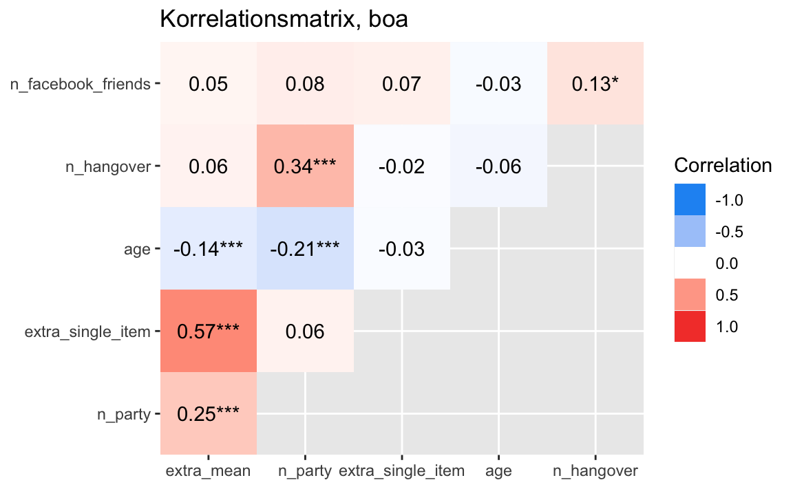

# Zentrale Ergebnisse


## Cave

Dieses Kapitel berichtet das *Wie* des Darstellens von Ergebnissen.
Es geht nicht darum, *warum* man welches Vorgehen wählt und welches Vorgehen am sinnvollsten ist.

Konsultieren Sie für letzteres das Statistikbuch Ihres Vertrauens :-)


## Vorbereitung


### R-Pakete


In diesem Kapitel benötigen wir folgende R-Pakete:


```r
library(tidyverse)  # Datenjudo
library(easystats)  # make stasts easy again
library(knitr)  # Tabellen schick
library(moderndive)  # Regressionsausgabe schick
library(rstanarm)  # Bayes
```


`{easystats}` ist ein Metapaket^[Nicht zu verwechseln mit Megapaket], ein R-Paket also, das mehrere R-Pakete beinhaltet.
[Hier](https://easystats.github.io/easystats/) findet sich ein Überblick.
Das Paket ist noch nicht auf CRAN,
aber es kann wie folgt problemlos installiert werden:


```r
install.packages("easystats", repos = "https://easystats.r-universe.dev")
```


### Daten


 

```r
data_url <- "https://raw.githubusercontent.com/sebastiansauer/modar/master/datasets/extra.csv"
extra <- read_csv(data_url)
```


## Relevante Variablen

Damit es einfach bleibt, begrenzen wir uns auf ein paar Variablen.

Sagen wir, 
das sind die Variablen, die uns interessieren:


```r
extra_corr_names <- 
extra %>% 
  select(n_facebook_friends, n_hangover, age, extra_single_item, n_party, extra_mean) %>% 
  names()

extra_corr_names
#> [1] "n_facebook_friends" "n_hangover"        
#> [3] "age"                "extra_single_item" 
#> [5] "n_party"            "extra_mean"
```


## Deskriptive Ergebnisse darstellen

Sie können deskriptive Ergebnisse (Ihrer relevanten Variablen) z.B. so darstellen.


```r
extra %>% 
  select(any_of(extra_corr_names)) %>% 
  describe_distribution() %>% 
  kable(digits = 2)
```


|Variable           |   Mean|      SD|   IQR|  Min|   Max| Skewness| Kurtosis|   n| n_Missing|
|:------------------|------:|-------:|-----:|----:|-----:|--------:|--------:|---:|---------:|
|n_facebook_friends | 532.61| 3704.48| 300.0|  0.0| 96055|    25.67|   662.76| 671|       155|
|n_hangover         |   9.47|   30.72|   9.0|  0.0|   738|    17.54|   399.53| 800|        26|
|age                |  25.50|    5.75|   6.0| 18.0|    54|     1.81|     4.39| 813|        13|
|extra_single_item  |   2.79|    0.86|   1.0|  1.0|     4|    -0.27|    -0.60| 816|        10|
|n_party            |  17.38|   19.32|  19.0|  0.0|   150|     3.27|    16.10| 793|        33|
|extra_mean         |   2.89|    0.45|   0.6|  1.2|     4|    -0.43|    -0.11| 822|         4|


## Korrelationen darstellen

In einer Umfrage erhebt man häufig mehrere Variablen, ein Teil davon oft *Konstrukte*.
Es bietet sich in einem ersten Schritt an, die Korrelationen dieser Variablen untereinander
darzustellen.


### Korrelationsmatrix


```r
extra %>% 
  select(any_of(extra_corr_names)) %>%  
  correlation() %>% 
  summary() %>% 
  kable(digits = 2)
```


|Parameter          | extra_mean| n_party| extra_single_item|   age| n_hangover|
|:------------------|----------:|-------:|-----------------:|-----:|----------:|
|n_facebook_friends |       0.05|    0.08|              0.07| -0.03|       0.13|
|n_hangover         |       0.06|    0.34|             -0.02| -0.06|         NA|
|age                |      -0.14|   -0.21|             -0.03|    NA|         NA|
|extra_single_item  |       0.57|    0.06|                NA|    NA|         NA|
|n_party            |       0.25|      NA|                NA|    NA|         NA|


Sie möchten das Ergebnis als normalen R-Dataframe? 
Sie haben keine Lust auf dieses Rumgetue, sondern wollen das lieber als selber gerade ziehen.
Also gut:


```r
cor_results <- 
extra %>% 
  select(any_of(extra_corr_names)) %>%  
  correlation() %>% 
  summary()

cor_results
#> # Correlation Matrix (pearson-method)
#> 
#> Parameter          | extra_mean |  n_party | extra_single_item |   age | n_hangover
#> -----------------------------------------------------------------------------------
#> n_facebook_friends |       0.05 |     0.08 |              0.07 | -0.03 |      0.13*
#> n_hangover         |       0.06 |  0.34*** |             -0.02 | -0.06 |           
#> age                |   -0.14*** | -0.21*** |             -0.03 |       |           
#> extra_single_item  |    0.57*** |     0.06 |                   |       |           
#> n_party            |    0.25*** |          |                   |       |           
#> 
#> p-value adjustment method: Holm (1979)
```


Man kann sich die Korrelationsmatrix auch in der Bayes-Geschmacksrichtung ausgeben lassen:


```r
extra %>% 
  select(any_of(extra_corr_names)) %>%  
  correlation(bayesian = TRUE) %>% 
  summary() %>% 
  kable(digits = 2)
```


|Parameter          | extra_mean| n_party| extra_single_item|   age| n_hangover|
|:------------------|----------:|-------:|-----------------:|-----:|----------:|
|n_facebook_friends |       0.05|    0.08|              0.07| -0.03|       0.13|
|n_hangover         |       0.05|    0.33|             -0.02| -0.06|         NA|
|age                |      -0.14|   -0.21|             -0.03|    NA|         NA|
|extra_single_item  |       0.56|    0.06|                NA|    NA|         NA|
|n_party            |       0.25|      NA|                NA|    NA|         NA|


### Korrelationsmatrizen visualisieren

Viele R-Pakete bieten sich an. Nehmen wir `{easystats}`.


```r
extra %>% 
  select(any_of(extra_corr_names)) %>%  
  correlation() %>% 
  summary() %>% 
  plot() +
  labs(title = "Korrelationsmatrix, boa")
```




## Regressionsergebnisse


### Frequentistisch


```r
lm1 <- lm(extra_mean ~ n_facebook_friends + n_hangover, data = extra)
```


```r
lm1_tab <- 
get_regression_table(lm1) 

lm1_tab %>% 
  kable(digits = 2)
```


|term               | estimate| std_error| statistic| p_value| lower_ci| upper_ci|
|:------------------|--------:|---------:|---------:|-------:|--------:|--------:|
|intercept          |     2.88|      0.02|    147.79|    0.00|     2.85|     2.92|
|n_facebook_friends |     0.00|      0.00|      0.66|    0.51|     0.00|     0.00|
|n_hangover         |     0.00|      0.00|      4.08|    0.00|     0.00|     0.01|


### Bayesianisch

Für Bayes gibt es keine ganz so komfortable Lösung.
Aber keine Panik, es sollte nur wenige Minuten kosten.


```r
lm2 <- stan_glm(extra_mean ~ n_facebook_friends + n_hangover, 
                refresh = 0,
                data = extra)
```

Ergebnisse, d.h. die Koeffizienten:


```r
parameters(lm2)
#> Parameter          |   Median |        95% CI |     pd | % in ROPE |  Rhat |     ESS |                     Prior
#> ----------------------------------------------------------------------------------------------------------------
#> (Intercept)        |     2.88 | [ 2.85, 2.92] |   100% |        0% | 1.000 | 4948.00 |     Normal (2.93 +- 1.10)
#> n_facebook_friends | 3.12e-06 | [ 0.00, 0.00] | 75.58% |      100% | 1.000 | 5300.00 | Normal (0.00 +- 2.95e-04)
#> n_hangover         | 4.55e-03 | [ 0.00, 0.01] |   100% |      100% | 0.999 | 4881.00 |     Normal (0.00 +- 0.07)
```


Und als Tabelle:


```r
parameters(lm2) %>% 
  kable(digits = 2)
```


|Parameter          | Median|   CI| CI_low| CI_high|   pd| ROPE_Percentage| Rhat|     ESS|Prior_Distribution | Prior_Location| Prior_Scale|
|:------------------|------:|----:|------:|-------:|----:|---------------:|----:|-------:|:------------------|--------------:|-----------:|
|(Intercept)        |   2.88| 0.95|   2.85|    2.92| 1.00|               0|    1| 4948.37|normal             |           2.93|        1.10|
|n_facebook_friends |   0.00| 0.95|   0.00|    0.00| 0.76|               1|    1| 5299.88|normal             |           0.00|        0.00|
|n_hangover         |   0.00| 0.95|   0.00|    0.01| 1.00|               1|    1| 4881.09|normal             |           0.00|        0.07|


Dazu noch $R^2$:


```r
r2_bayes(lm2)
#> # Bayesian R2 with Compatibility Interval
#> 
#>   Conditional R2: 0.028 (95% CI [0.008, 0.054])
```


Das schreiben Sie entweder als Fußnote unter die Tabelle oder erwähnen es im Text.


### Reportr

Hier ist noch ein experimentelles Feature:
Es gibt Ihnen den Text aus, um die Ergebnisse Ihrer Bayes-Analyse zu berichten.


```r
report(lm2)
```

We fitted a Bayesian linear model (estimated using MCMC sampling with 4 chains of 2000 iterations and a warmup of 1000) to predict extra_mean with n_facebook_friends and n_hangover (formula: extra_mean ~ n_facebook_friends + n_hangover). Priors over parameters were set as normal (mean = 0.00, SD = 2.95e-04) and normal (mean = 0.00, SD = 0.07) distributions. The model's explanatory power is weak (R2 = 0.03, 95% CI [7.66e-03, 0.05], adj. R2 = 0.01). The model's intercept, corresponding to n_facebook_friends = 0 and n_hangover = 0, is at 2.88 (95% CI [2.85, 2.92]). Within this model:

  - The effect of n facebook friends (Median = 3.12e-06, 95% CI [-5.98e-06, 1.18e-05]) has a 75.58% probability of being positive (> 0), 0.00% of being significant (> 0.02), and 0.00% of being large (> 0.13). The estimation successfully converged (Rhat = 1.000) and the indices are reliable (ESS = 5300)
  - The effect of n hangover (Median = 4.55e-03, 95% CI [2.38e-03, 6.74e-03]) has a 100.00% probability of being positive (> 0), 0.00% of being significant (> 0.02), and 0.00% of being large (> 0.13). The estimation successfully converged (Rhat = 0.999) and the indices are reliable (ESS = 4881)

Following the Sequential Effect eXistence and sIgnificance Testing (SEXIT) framework, we report the median of the posterior distribution and its 95% CI (Highest Density Interval), along the probability of direction (pd), the probability of significance and the probability of being large. The thresholds beyond which the effect is considered as significant (i.e., non-negligible) and large are |0.02| and |0.13| (corresponding respectively to 0.05 and 0.30 of the outcome's SD). Convergence and stability of the Bayesian sampling has been assessed using R-hat, which should be below 1.01 (Vehtari et al., 2019), and Effective Sample Size (ESS), which should be greater than 1000 (Burkner, 2017).

Hier wird das sog. [SEXIT](https://easystats.github.io/bayestestR/reference/sexit.html)-Framework verwendet.

## Tabellen von R nach Word

### Rmd-Dokument als Word-Dokument ausgeben lassen.


Vielleicht die einfachste Möglichkeit: Erstellen Sie Ihre Analyse nicht als .R-Daten, sondern als .Rmd-Datei.
Dann "knittern" Sie die Analyse als Word-Dokument. Fertig!

Um eine schicke Tabelle zu bekommen,
nutzen Sie die den Befehl `kable()`. 
Den wenden Sie auf einen Dataframe an, der als schicke Tabelle auf die Welt kommen soll.


### Rmd-Dokument copy-pasten


Sie können auch Folgendes tun: Erstellen Sie Ihre Analyse als Rmd-Datei;
knittern Sie das Dokument.
Sie erhalten dann ein HTML-Dokument, aus dem Sie problemlos copy-pasten können (von HTML nach Word).


### Ich will kein Rmd!


Wenn Sie (partout) nicht mit Rmd-Dateien arbeiten wollen,
hilft Ihnen das R-Paket `{flextable}`:


```r
library(flextable)
```


```r
meine_flex_tab <- flextable(lm1_tab)

meine_flex_tab
```

```{=html}
<template id="ce53286e-8dfe-424c-9212-e7d989a9d343"><style>
.tabwid table{
  border-spacing:0px !important;
  border-collapse:collapse;
  line-height:1;
  margin-left:auto;
  margin-right:auto;
  border-width: 0;
  display: table;
  margin-top: 1.275em;
  margin-bottom: 1.275em;
  border-color: transparent;
}
.tabwid_left table{
  margin-left:0;
}
.tabwid_right table{
  margin-right:0;
}
.tabwid td {
    padding: 0;
}
.tabwid a {
  text-decoration: none;
}
.tabwid thead {
    background-color: transparent;
}
.tabwid tfoot {
    background-color: transparent;
}
.tabwid table tr {
background-color: transparent;
}
</style><div class="tabwid"><style>.cl-07368926{}.cl-072bc0cc{font-family:'Helvetica';font-size:11pt;font-weight:normal;font-style:normal;text-decoration:none;color:rgba(0, 0, 0, 1.00);background-color:transparent;}.cl-072bdff8{margin:0;text-align:left;border-bottom: 0 solid rgba(0, 0, 0, 1.00);border-top: 0 solid rgba(0, 0, 0, 1.00);border-left: 0 solid rgba(0, 0, 0, 1.00);border-right: 0 solid rgba(0, 0, 0, 1.00);padding-bottom:5pt;padding-top:5pt;padding-left:5pt;padding-right:5pt;line-height: 1;background-color:transparent;}.cl-072be00c{margin:0;text-align:right;border-bottom: 0 solid rgba(0, 0, 0, 1.00);border-top: 0 solid rgba(0, 0, 0, 1.00);border-left: 0 solid rgba(0, 0, 0, 1.00);border-right: 0 solid rgba(0, 0, 0, 1.00);padding-bottom:5pt;padding-top:5pt;padding-left:5pt;padding-right:5pt;line-height: 1;background-color:transparent;}.cl-072c242c{width:54pt;background-color:transparent;vertical-align: middle;border-bottom: 0 solid rgba(0, 0, 0, 1.00);border-top: 0 solid rgba(0, 0, 0, 1.00);border-left: 0 solid rgba(0, 0, 0, 1.00);border-right: 0 solid rgba(0, 0, 0, 1.00);margin-bottom:0;margin-top:0;margin-left:0;margin-right:0;}.cl-072c2436{width:54pt;background-color:transparent;vertical-align: middle;border-bottom: 0 solid rgba(0, 0, 0, 1.00);border-top: 0 solid rgba(0, 0, 0, 1.00);border-left: 0 solid rgba(0, 0, 0, 1.00);border-right: 0 solid rgba(0, 0, 0, 1.00);margin-bottom:0;margin-top:0;margin-left:0;margin-right:0;}.cl-072c2437{width:54pt;background-color:transparent;vertical-align: middle;border-bottom: 2pt solid rgba(102, 102, 102, 1.00);border-top: 0 solid rgba(0, 0, 0, 1.00);border-left: 0 solid rgba(0, 0, 0, 1.00);border-right: 0 solid rgba(0, 0, 0, 1.00);margin-bottom:0;margin-top:0;margin-left:0;margin-right:0;}.cl-072c2440{width:54pt;background-color:transparent;vertical-align: middle;border-bottom: 2pt solid rgba(102, 102, 102, 1.00);border-top: 0 solid rgba(0, 0, 0, 1.00);border-left: 0 solid rgba(0, 0, 0, 1.00);border-right: 0 solid rgba(0, 0, 0, 1.00);margin-bottom:0;margin-top:0;margin-left:0;margin-right:0;}.cl-072c2441{width:54pt;background-color:transparent;vertical-align: middle;border-bottom: 2pt solid rgba(102, 102, 102, 1.00);border-top: 2pt solid rgba(102, 102, 102, 1.00);border-left: 0 solid rgba(0, 0, 0, 1.00);border-right: 0 solid rgba(0, 0, 0, 1.00);margin-bottom:0;margin-top:0;margin-left:0;margin-right:0;}.cl-072c244a{width:54pt;background-color:transparent;vertical-align: middle;border-bottom: 2pt solid rgba(102, 102, 102, 1.00);border-top: 2pt solid rgba(102, 102, 102, 1.00);border-left: 0 solid rgba(0, 0, 0, 1.00);border-right: 0 solid rgba(0, 0, 0, 1.00);margin-bottom:0;margin-top:0;margin-left:0;margin-right:0;}</style><table class='cl-07368926'>
```

```{=html}
<thead><tr style="overflow-wrap:break-word;"><td class="cl-072c244a"><p class="cl-072bdff8"><span class="cl-072bc0cc">term</span></p></td><td class="cl-072c2441"><p class="cl-072be00c"><span class="cl-072bc0cc">estimate</span></p></td><td class="cl-072c2441"><p class="cl-072be00c"><span class="cl-072bc0cc">std_error</span></p></td><td class="cl-072c2441"><p class="cl-072be00c"><span class="cl-072bc0cc">statistic</span></p></td><td class="cl-072c2441"><p class="cl-072be00c"><span class="cl-072bc0cc">p_value</span></p></td><td class="cl-072c2441"><p class="cl-072be00c"><span class="cl-072bc0cc">lower_ci</span></p></td><td class="cl-072c2441"><p class="cl-072be00c"><span class="cl-072bc0cc">upper_ci</span></p></td></tr></thead><tbody><tr style="overflow-wrap:break-word;"><td class="cl-072c2436"><p class="cl-072bdff8"><span class="cl-072bc0cc">intercept</span></p></td><td class="cl-072c242c"><p class="cl-072be00c"><span class="cl-072bc0cc">2.884</span></p></td><td class="cl-072c242c"><p class="cl-072be00c"><span class="cl-072bc0cc">0.020</span></p></td><td class="cl-072c242c"><p class="cl-072be00c"><span class="cl-072bc0cc">147.789</span></p></td><td class="cl-072c242c"><p class="cl-072be00c"><span class="cl-072bc0cc">0.000</span></p></td><td class="cl-072c242c"><p class="cl-072be00c"><span class="cl-072bc0cc">2.846</span></p></td><td class="cl-072c242c"><p class="cl-072be00c"><span class="cl-072bc0cc">2.922</span></p></td></tr><tr style="overflow-wrap:break-word;"><td class="cl-072c2436"><p class="cl-072bdff8"><span class="cl-072bc0cc">n_facebook_friends</span></p></td><td class="cl-072c242c"><p class="cl-072be00c"><span class="cl-072bc0cc">0.000</span></p></td><td class="cl-072c242c"><p class="cl-072be00c"><span class="cl-072bc0cc">0.000</span></p></td><td class="cl-072c242c"><p class="cl-072be00c"><span class="cl-072bc0cc">0.655</span></p></td><td class="cl-072c242c"><p class="cl-072be00c"><span class="cl-072bc0cc">0.513</span></p></td><td class="cl-072c242c"><p class="cl-072be00c"><span class="cl-072bc0cc">0.000</span></p></td><td class="cl-072c242c"><p class="cl-072be00c"><span class="cl-072bc0cc">0.000</span></p></td></tr><tr style="overflow-wrap:break-word;"><td class="cl-072c2440"><p class="cl-072bdff8"><span class="cl-072bc0cc">n_hangover</span></p></td><td class="cl-072c2437"><p class="cl-072be00c"><span class="cl-072bc0cc">0.005</span></p></td><td class="cl-072c2437"><p class="cl-072be00c"><span class="cl-072bc0cc">0.001</span></p></td><td class="cl-072c2437"><p class="cl-072be00c"><span class="cl-072bc0cc">4.085</span></p></td><td class="cl-072c2437"><p class="cl-072be00c"><span class="cl-072bc0cc">0.000</span></p></td><td class="cl-072c2437"><p class="cl-072be00c"><span class="cl-072bc0cc">0.002</span></p></td><td class="cl-072c2437"><p class="cl-072be00c"><span class="cl-072bc0cc">0.007</span></p></td></tr></tbody></table></div></template>
<div class="flextable-shadow-host" id="94fbfa52-2021-4b25-adbf-ec8d5decd0b1"></div>
<script>
var dest = document.getElementById("94fbfa52-2021-4b25-adbf-ec8d5decd0b1");
var template = document.getElementById("ce53286e-8dfe-424c-9212-e7d989a9d343");
var caption = template.content.querySelector("caption");
if(caption) {
  caption.style.cssText = "display:block;text-align:center;";
  var newcapt = document.createElement("p");
  newcapt.appendChild(caption)
  dest.parentNode.insertBefore(newcapt, dest.previousSibling);
}
var fantome = dest.attachShadow({mode: 'open'});
var templateContent = template.content;
fantome.appendChild(templateContent);
</script>

```


Dieses Objekt können Sie dann als .docx abspeichern:


```r
save_as_docx("Tabelle 1 " = meine_flex_tab, path = "meine_tab.docx")
```


