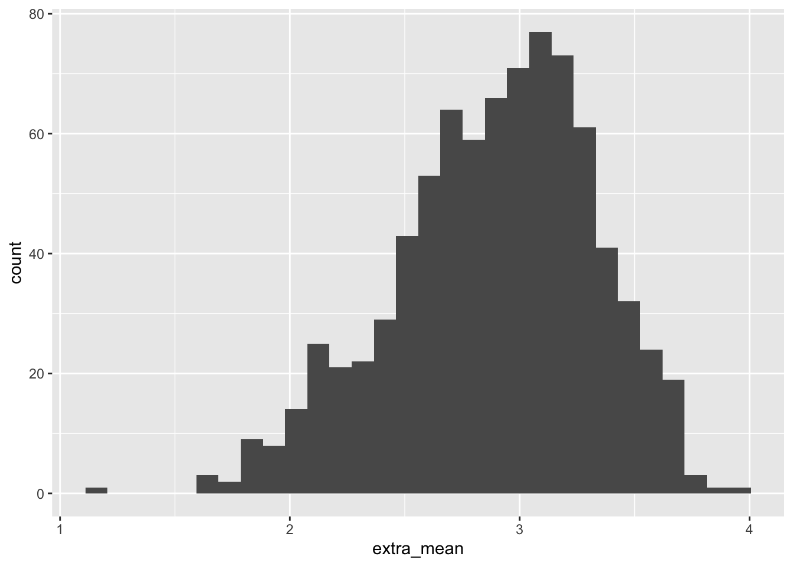
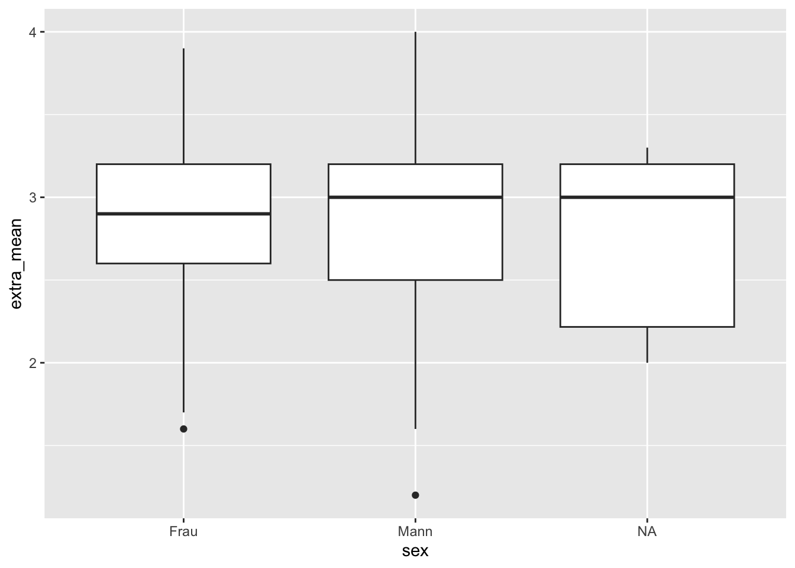

# Diagnostische Kennwerte


## R-Pakete


In diesem Kapitel benötigen wir folgende R-Pakete:


```r
library(tidyverse)  # Datenjudo
library(psych)  # Itemanalyse
```


## Daten


```r
data_url <- "https://raw.githubusercontent.com/sebastiansauer/modar/master/datasets/extra.csv"
extra <- read_csv(data_url)
#> Rows: 826 Columns: 34
#> ── Column specification ────────────────────────────────────
#> Delimiter: ","
#> chr  (8): timestamp, code, sex, presentation, clients, e...
#> dbl (25): i01, i02r, i03, i04, i05, i06r, i07, i08, i09,...
#> lgl  (1): i21
#> 
#> ℹ Use `spec()` to retrieve the full column specification for this data.
#> ℹ Specify the column types or set `show_col_types = FALSE` to quiet this message.
```


## Vergleich vieler Personen (interindividual differenzierende Diagnostik)


### Histogramm

Eine grundlegende Visualisierung für eine Verteilung - wie z.B. die Testergebnisse einer Stichprobe an Bewerbern - ist ein Histogramm:


```r
extra %>% 
  ggplot(aes(x = extra_mean)) +
  geom_histogram()
#> `stat_bin()` using `bins = 30`. Pick better value with
#> `binwidth`.
#> Warning: Removed 4 rows containing non-finite values
#> (`stat_bin()`).
```




Möchte man mehrere Gruppen vergleichen, so ist der Boxplot eine geeignete Visualisierung:


```r
extra %>% 
  ggplot(aes(y = extra_mean, x = sex)) +
  geom_boxplot()
#> Warning: Removed 4 rows containing non-finite values
#> (`stat_boxplot()`).
```




<!-- Eine Variante, etwas aufgebügelt: -->


<!-- ```{r} -->
<!-- extra %>%  -->
<!--   mutate(sex = factor(sex)) %>%  -->
<!--   ggbetweenstats(data = extra, -->
<!--   x = sex,  -->
<!--   y = extra_mean -->
<!-- ) -->
<!-- ``` -->

<!-- Hier werden noch einige (Test-)statistiken angegeben. -->

<!-- ### Dotplot -->

<!-- Ein häufiges Szenario in der Diagnostik ist die vergleichende Analyse einer Reihe von Personen z.B. Bewerbern. Bringen wir die Gesamtwerte einer Auswahl von Personen in ein Diagramm. Ein "Dotplot" ist dazu eine interessante Möglichkeit: -->


<!-- ```{r fig.asp = 1} -->
<!-- extra %>% -->
<!--   slice_head(n=5) %>% -->
<!-- ggdotplotstats( -->
<!--   y = code, -->
<!--   x = extra_mean -->
<!-- ) -->
<!-- ``` -->


##  Einzelfalldiagnostik


Bisher haben wir *einen* Wert pro Person ausgerechnet; 
in einigen Fällen wird man daran interessiert sein, *mehrere* Werte einer Person (bzw. einer Beobachtungseinheit) zu berechnen, um ein Profil zu erstellen. 
Gehen wir im Folgenden davon aus, dass die einzelnen 10 Items der Extraversionsskala hinreichend belastbare Messwerte sind, 
die sich lohnen, einzeln darzustellen. 
Der Übersichtlichkeit halber begrenzen wir uns auf die Darstellung von sehr wenig Personen.


### Spinnendiagramm


Ein Spinnennetz- oder Radardiagramm ist eine Möglichkeit, 
ein Werteprofil einer oder mehrerer Personen gleichzeitig darzustellen. 
Es weißt allerdings gravierende Mängel auf (siehe[hier](https://rpubs.com/Xtophe/268920)), 
so dass insgesamt von diesem Diagramm abgeraten werden muss.


```r
library(radarchart)

labs <- c("Communicator", "Data Wangler", "Programmer",
          "Technologist",  "Modeller", "Visualizer")

items <- c("i01", "i02r", "i03", "i04", "i05", "i06")

scores <- list(
  "Anna" = c(9, 7, 4, 5, 3, 7),
  "Bert" = c(7, 6, 6, 2, 6, 9),
  "Carl" = c(6, 5, 8, 4, 7, 6)
)

chartJSRadar(scores = scores, labs = items, maxScale = 10)
```


