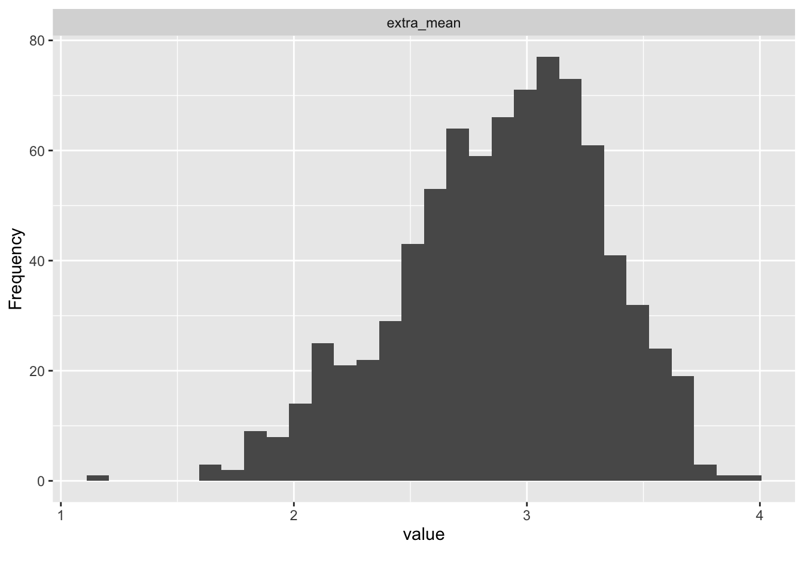

# Fallstudie Normierung


```r
library(tidyverse)
library(DataExplorer)
library(easystats)
library(knitr)   # für "kable", erstellt HTML-Tabellen
```


## Explorative Datenanalyse


```r
data_url <- "https://raw.githubusercontent.com/sebastiansauer/modar/master/datasets/extra.csv"
extra <- read_csv(data_url)
```


```r
extra %>% 
  select(ends_with("_mean")) %>% 
  plot_histogram()
```




```r
extra %>% 
  select(extra_mean, n_facebook_friends, n_hangover, age, sex, time_conversation, sleep_week, sleep_wend) %>% 
  describe_distribution()
#> Variable           |     Mean |       SD |    IQR |            Range | Skewness | Kurtosis |   n | n_Missing
#> ------------------------------------------------------------------------------------------------------------
#> extra_mean         |     2.89 |     0.45 |   0.60 |     [1.20, 4.00] |    -0.43 |    -0.11 | 822 |         4
#> n_facebook_friends |   532.61 |  3704.48 | 300.00 | [0.00, 96055.00] |    25.67 |   662.76 | 671 |       155
#> n_hangover         |     9.47 |    30.72 |   9.00 |   [0.00, 738.00] |    17.54 |   399.53 | 800 |        26
#> age                |    25.50 |     5.75 |   6.00 |   [18.00, 54.00] |     1.81 |     4.39 | 813 |        13
#> time_conversation  | 1.34e+06 | 3.65e+07 |  10.00 | [0.00, 1.00e+09] |    27.37 |   749.00 | 749 |        77
#> sleep_week         |    18.00 |    26.98 |   2.00 |    [5.00, 85.00] |     2.16 |     3.46 |  12 |       814
#> sleep_wend         |     8.25 |     1.22 |   2.75 |    [7.00, 10.00] |     0.52 |    -1.27 |  12 |       814
```


## Normwerte berechnen


### Hilfsfunktionen

Zwei Hilfskräfte: Die erste Funktion berechnet Normwerte, s.[Infos here](https://de.wikipedia.org/wiki/Normwertskala):


```r
convert_to_norm_value <- function(score, data_vec, mu = 0, sigma = 1) {
  out <- ((score - mean(data_vec, na.rm = TRUE)) / sd(data_vec)) * sigma + mu
  return(out)
}
```


Probieren wir es aus. Aber zuerst müssen wir die `NA` entfernen,
da das `convert_to_norm_value` nicht kann.


```r
extra_drop_na <- 
extra %>% 
  select(extra_mean) %>% 
  drop_na()
  
convert_to_norm_value(score = 3, data_vec = extra_drop_na$extra_mean)
#> [1] 0.2415975
```
```


Diese Funktion wenden wir für mehrere Normierungsarten an, im Rahmen einer zweiten Funktion:


```r
compute_all_norms <- function(x, min_score = 0, max_score = max(x), by = .5){
  
  x_ecdf <- ecdf(x)  # empircal cumulative distribution function - gives back function
  
  out <-
    tibble(
      score = seq(from = min_score, to = max_score, by = by),
      perc_rank = x_ecdf(score),
      z = map_dbl(score, ~ convert_to_norm_value(.x, data_vec = x)),
      stanine = map_dbl(score, ~ convert_to_norm_value(.x, data_vec = x, mu = 5, sigma = 2)),
      T = map_dbl(score, ~ convert_to_norm_value(.x, data_vec = x, mu = 50, sigma = 10)),
      perc_normal = map_dbl(z, pnorm)
    ) %>% 
    mutate(stanine = case_when(
      stanine > 9 ~ 9,
      stanine < 1 ~ 1,
      TRUE ~ stanine
    ))
  return(out)
}
```


### Normwerte berechnen


```r
extra %>% 
  select(ends_with("_mean")) %>% 
  map(~ kable(compute_all_norms(., min_score = 1, max_score = 4, by = .1), 
                     digits = 2)) %>% 
  print()
```

$extra_mean


| score| perc_rank|  z| stanine|  T| perc_normal|
|-----:|---------:|--:|-------:|--:|-----------:|
|   1.0|      0.00| NA|      NA| NA|          NA|
|   1.1|      0.00| NA|      NA| NA|          NA|
|   1.2|      0.00| NA|      NA| NA|          NA|
|   1.3|      0.00| NA|      NA| NA|          NA|
|   1.4|      0.00| NA|      NA| NA|          NA|
|   1.5|      0.00| NA|      NA| NA|          NA|
|   1.6|      0.00| NA|      NA| NA|          NA|
|   1.7|      0.01| NA|      NA| NA|          NA|
|   1.8|      0.02| NA|      NA| NA|          NA|
|   1.9|      0.03| NA|      NA| NA|          NA|
|   2.0|      0.05| NA|      NA| NA|          NA|
|   2.1|      0.08| NA|      NA| NA|          NA|
|   2.2|      0.10| NA|      NA| NA|          NA|
|   2.3|      0.12| NA|      NA| NA|          NA|
|   2.4|      0.16| NA|      NA| NA|          NA|
|   2.5|      0.21| NA|      NA| NA|          NA|
|   2.6|      0.28| NA|      NA| NA|          NA|
|   2.7|      0.36| NA|      NA| NA|          NA|
|   2.8|      0.43| NA|      NA| NA|          NA|
|   2.9|      0.51| NA|      NA| NA|          NA|
|   3.0|      0.60| NA|      NA| NA|          NA|
|   3.1|      0.69| NA|      NA| NA|          NA|
|   3.2|      0.78| NA|      NA| NA|          NA|
|   3.3|      0.85| NA|      NA| NA|          NA|
|   3.4|      0.90| NA|      NA| NA|          NA|
|   3.5|      0.94| NA|      NA| NA|          NA|
|   3.6|      0.97| NA|      NA| NA|          NA|
|   3.7|      0.99| NA|      NA| NA|          NA|
|   3.8|      1.00| NA|      NA| NA|          NA|
|   3.9|      1.00| NA|      NA| NA|          NA|
|   4.0|      1.00| NA|      NA| NA|          NA|

