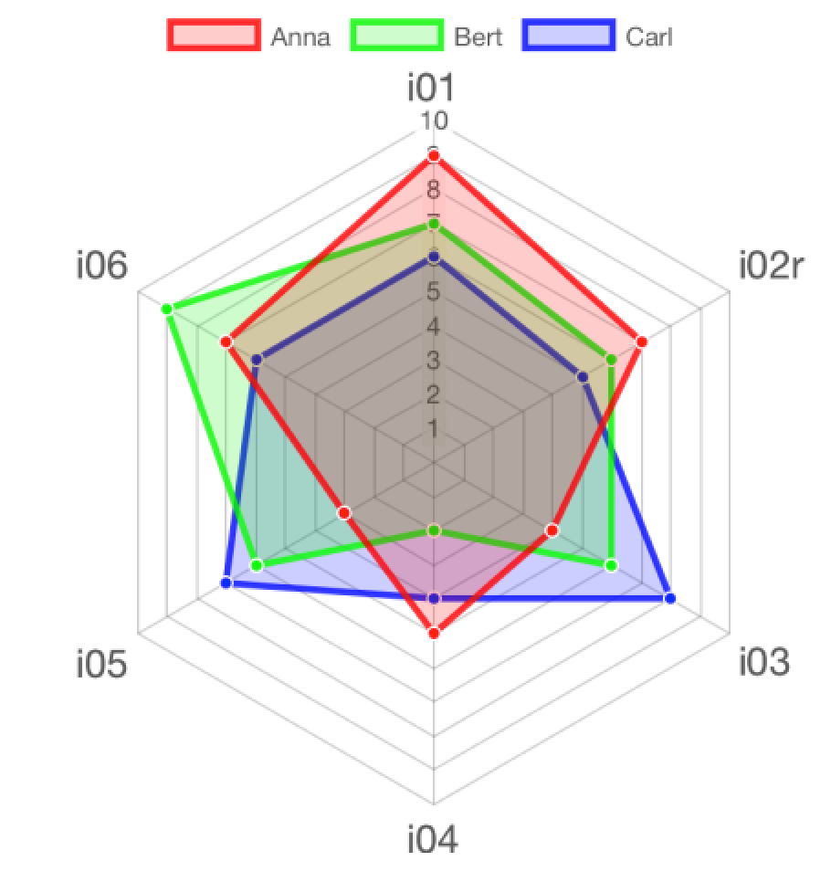

--- 
title: "Umfragen auswerten"
author: "Sebastian Sauer"
date: "2022-05-25 14:27:00"
site: bookdown::bookdown_site
documentclass: book
bibliography: [book.bib, packages.bib]
# url: your book url like https://bookdown.org/yihui/bookdown
# cover-image: path to the social sharing image like images/cover.jpg
description: |
  Umfragen auswerten: Statistische Analyse psychometrisch fundierter Ratingskalen
biblio-style: apalike
#   csl: chicago-fullnote-bibliography.csl
---


# Einleitung


Fragebogendaten zu psychologischen Variablen (wie z.B. Extraversion), die wissenschaftlichen Ansprüchen genügen, bezeichnet man als *psychometrische Daten* [vgl. @Steyer1993]. 
Der Analyse psychometrischer Daten kommt große Bedeutung innerhalb der Psychologie (und angrenzender Gebiete wie Marketing) zu. 
Der Grund ist, dass Daten häufig in Form von Fragebogen, psychometrischer Fragebogen, erhoben werden. 
Besonders für Persönlichkeitskonstrukte und Einstellungen, kurz für Fragestellungen der Persönlichkeitspsychologie und, davon abgeleitet, der Diagnostik, 
erfreuen sie sich weiter Verbreitung.


Ziel dieses Beitrags ist es, eine praktische Anleitung für typische (und grundlegende) psychometrischen Analysen mittels R zu geben. 
Dabei soll demonstriert und erläutert werden, welche Analysen und wie durchgeführt werden 
in einer grundständigen psychometrischen Analyse. 
Es wird sowohl der Einzelfall-Diagnostik Rechnung getragen, als auch der Testvalidierung. 
Anders gesagt, dieses Dokument hilft, u.a. folgende Fragen zu beantworten: 
"Wie leistungsfähig war der Applikant im Vergleich zu seiner Referenzgruppe?", 
"Wie ist die Qualität dieses Testverfahrens einzuschätzen?".

*Test* wird hier verstanden sensu @Lienert1998 (S. 14f): 

>   ein wissenschaftliches Routineverfahren zur Untersuchung eines oder mehrerer empirisch abgrenzbarer Persönlichkeitsmerkmale mit dem Ziel einer möglichst quantitativen Aussage über den relativen Grad der individuellen Merkmalsausprägung.


Inhalte werden im Rahmen einer *Fallstudie* erarbeitet; 
d.h. es wird ein echter Datensatz analysiert, wobei einige Hintergründe zu den verwendeten Methoden erläutert werden.


## Hilfe zu R


Eine praktische Einführung zu Datenanalyse bietet [ModernDive](https://moderndive.com/) (auf Englisch); eine umfassende Einführung in Englisch findet sich bei @Sauer2019.


## Zu messendes Konstrukt: Extraversion


@Satow2012 definiert Extraversion wie folgt:
  
  >   Extraversion (E) (Gegenteil: Introversion): Bereits C.G. Jung (1921) hatte beobachtet, dass Menschen entweder eher nach außen (gesellig, gesprächig, abenteuerlustig) oder nach innen orientiert (nachdenklich, in-sich-gekehrt) sind. Aufgrund dieser Beobachtungen hielt Eysenck (1947) Extraversion für einen der drei wesentlichen Persönlichkeitsdimensionen. Spätere Untersuchungen konnten zeigen, dass erfolgreiche Führungskräfte häufig eher extravertiert sind und dass Arbeitsleistung und Arbeitszufriedenheit generell mit Extraversion korrelieren (Judge et al., 2002; Lim \& Ployhart, 2004) – wobei es jedoch auch Ausnahmen gibt. So sind überraschend viele erfolgreiche Unternehmensgründer und besonders innovative Persönlichkeiten wie Bill Gates, Warren Buffett oder Steven Spielberg häufig überraschend introvertiert (Jones, 2006).


## Messinstrument

Es wird ein Datensatz zur Extraversion analysiert. Extraversion wurde operationalisiert mit dem Inventar *B5T* von Satow REF^[vgl. <https://www.drsatow.de/tests/persoenlichkeitstest/>]. Das Instrument besteht aus 10 Items mit vier Likert-Antwortstufen (von "trifft gar nicht zu" bis "trifft voll und ganz zu") und ist für Forschungszwecke kostenlos nutzbar^[https://www.drsatow.de/tests/persoenlichkeitstest/]:
  
  >    der B5T ist als Paper-Pencil-Version, Excel-Version sowie als Online-Version verfügbar und kann für nichtkommerzielle Forschungs- und für Unterrichtszwecke kostenlos verwendet werden. Der B5T wurde offiziell in die PSYNDEX-Testdatenbank (Tests-Nr. 9006357) und in das elektronische Testarchiv des Leibniz-Zentrums für Psychologische Information und Dokumentation (ZPID) aufgenommen.


An anderer Stelle^[https://www.drsatow.de/cgi-bin/testorder/testorder17_0.pl?t=B5T&s=1] ist zur Lizenz zu lesen:
  
  >   Lizenz: Sie dürfen den Test ausschließlich zu Forschungs- und Unterrichtszwecken einsetzen und übersetzen. Sie müssen die Quelle nennen und ein elektronisches Belegexemplar oder die Quellenangabe (Autor, Titel, Zeitschrift/Buch, Erscheinungsjahr) Ihrer Veröffentlichung an mailATdrsatow.de senden.


Zur Reliabilität berichtet @Satow2012, dass Cronbachs Alpha bei .87 läge, was ein guter Wert ist. Machen wir diese Variable für R verfügbar:


```r
extra_alpha <- .87
```


Der Test hat einige Validierungsstudien erfahren, allerdings ist die Qualität dieser Studien zum Teil fraglich, da es sich um "graue" Literatur handelt, also Literatur, die nicht öffentlich (einfach) zugänglich ist. Außerdem gibt es kaum Fachartikel, die ein Blind-Begutachtungsverfahren durchlaufen hätten; die meisten Studien zum B5T basieren auf Abschlussarbeiten; auch einige von FOM-Studierenden sind zu finden.

Die Items zum Test sind über die Webseite des Anbieters abrufbar^[https://www.psychomeda.de/online-tests/persoenlichkeitstest.html].


## R-Pakete

Folgende R-Pakete werden für diesen Kurs benötigt. 
Bitte stellen Sie sicher, dass Sie diese Pakete vor Beginn der Analyse installiert haben. 
Sie installieren ein R-Paket mit dem Befehl `install.packages(name_des_pakets)`.


```r
library(mosaic)  # Statistik allgemein
library(tidyverse)  # Datenjudo
library(sjmisc)  # Deskriptive Statistik
# library(apa)  # Statistiken nach APA formatieren
library(mice)  # Hilfen für fehlende Werte
library(devtools)  # Pakete von Github installieren
library(ggstatsplot)  # Visualisierung
library(janitor)  # Daten aufräumen
library(ggpubr)  # Visualisierung
library(psych)  # psychometrische Analyse
```


## Vertiefung: Infos zu Paketen

Sie fragen sich, was das Paket `praise()`, `fortunues()` oder `R_for_superheros()`^[noch nicht entwickelt] für Sie bereithält? Mit folgender Funktion bekommen Sie die Hilfe-Seiten eines Pakets angezeigt.


```r
help(package = "apa") 
```


## Daten

### Daten - aus Paket `pradadata`

Die Daten können über mehrere Weg abgerufen werden. Eine Möglichkeit bietet das R-Paket `pradadata`^[https://github.com/sebastiansauer/pradadata], da es auf Github^[https://github.com/] zu finden ist, muss zuerst ein Paket verfügbar sein, dass R-Paket von dort aus installiert. Dazu verwenden wir das Paket `devtools`; wie jedes Paket muss es zuerst installiert sein:
  

```r
install.packages("devtools")  # nur einmalig
```


Dann können wir das Paket installieren:
  
  

```r
install_github("sebastiansauer/pradadata")
```


laden und daraus den Datensatz zur Extraversion:
  

```r
library("pradadata")
data(extra)
```


Betrachten wir den Datensatz


```r
inspect(extra)
```


### Daten - via Webseite

*Alternativ* zur Installation via R-Paket `pradadata` stehen die Daten  unter diesem Link zum Herunterladen bereit:
  

```r
data_url <- "https://raw.githubusercontent.com/sebastiansauer/modar/master/datasets/extra.csv"
extra <- read_csv(data_url)
```


### Umfrage zu den Daten

Die Daten wurden [mit dieser Umfrage](https://forms.gle/c44Rx5H443Z4iC5s6) erhoben.


## Technische Hinweise

Sessioninfo:


- Datum: 2022-05-25
- R-Version: R version 4.2.0 (2022-04-22)
- Betriebssystem: 


<!--chapter:end:index.Rmd-->

# Daten aufräumen


## R-Pakete


In diesem Kapitel benötigen wir folgende R-Pakete:


```r
library(tidyverse)  # Datenjudo
library(sjmisc)  # recode
library(ggstatsplot)  # Diagram aufbügeln
library(mice)  # Fehlende Werte ersetzen
```


## Daten


 

```r
data_url <- "https://raw.githubusercontent.com/sebastiansauer/modar/master/datasets/extra.csv"
extra <- read_csv(data_url)
```


## Überblick


Häufig sind Daten noch nicht "aufbereitet" und müssen noch "geputzt" oder "aufgeräumt" werden. Dazu gehören Schritte wie

- Daten umkodieren
- Daten aggregieren
- Daten gruppieren
- Fehlende Werte ersetzen
- Datenqualität prüfen
- Verteilungsformen prüfen
- Ausreißer behandeln

Betrachten wir einige zentrale Aspekte dieser Schritte.


## Brave Daten

Wie muss eine Tabelle gestaltet sein,
damit man sie gut in R importieren kann, bzw. gut damit weiterarbeiten kann?

[Das ist eine gute Quelle](https://www.tandfonline.com/doi/full/10.1080/00031305.2017.1375989) zu diesem Thema.

Im Überblick sollten Sie auf Folgendes achten:

- Wenn Sie händisch Daten eintragen, hacken Sie das einfach in Excel sein.
- CSV-Dateien bieten sich als Datenformat an.
- Alternativ kann man auch Excel-Dateien in R importieren.
- Es muss genau eine Kopfzeile geben.
- Es darf keine Lücken geben (leere Zeilen oder Spalten oder Zellen).
- Vermeiden Sie Umlaute und Leerzeichen in den Variablennamen.


Beachten Sie das Prinzip von "tidy data":

- In jeder Zeile steht *eine Beobachtung*.
- In jeder Spalte steht *eine Variable*.
- In jeder Zelle steht *eine Wert*.


## Text in Zahlen umwandeln


### Hilfe, ich habe keine Zahlen

Kennen Sie das? Sie haben eine Umfrage durchgeführt, Daten sind erhoben, puh, bald können Sie das Projekt abschließen.

Jetzt haben Sie die Daten in R importiert,
aber müssen zu Ihrem Schrecken feststellen,
dass die Spalten (Variablen) die eigentlich Zahlen sein sollten, 
als `character`, Text also, formatiert sind in R.

Anstelle der Zahl `5` steht in der Spalte also `"5"` (man beachte die Anführungszeichen, die anzeigen, dass es sich um einen Text handelt).

Na toll.

Mit Wörtern (Text) kann man nicht rechnen, und Sie rechnen doch so gern...

R weigert sich standhaft, mit Text zu rechnen:


```r
"5" + "5"
#> Error in "5" + "5": non-numeric argument to binary operator
```

Hätten wir brave Zahlen, wäre alles paletti:


```r
5+5
#> [1] 10
```

Der Einfachheit halber erzeugen wir uns eine einfache Tabelle, mit ein paar Spalten,
die *als Text* formatierte Zahlen enthalten:


```r
library(tidyverse)

d <- tibble(i01 = c("1", "3", "4"),  # von 1 bis 4
            i02 = c("-2", "+3", "-1"),  # von -3 bis -3
            i03 = factor(c("-2", "+2", "-1")))  # als Faktorvariable formatiert
d
#> # A tibble: 3 × 3
#>   i01   i02   i03  
#>   <chr> <chr> <fct>
#> 1 1     -2    -2   
#> 2 3     +3    +2   
#> 3 4     -1    -1
```

Für diejenigen, die kompliziert mögen, ist hier noch eine `factor`-Spalte hinzugefügt. Erstmal ignorieren.

Stellen Sie sich vor, die Tabelle ist ein Auszug aus Ihrer Umfrage,
wobei `i01` das erste Item (Frage) Ihres Fragebogens darstellt etc.


Wie kann man R beibringen, 
dass die fraglichen Spalte `i01` doch "in Wirklichkeit" Zahlen sind und kein Text?

Welcher R-Befehl hilft hier? 

### Introducing `parse_number()`

`parse_number()` (aus `{tidyverse}`) löst das Problem für Sie:


```r
d2 <- 
  d %>% 
  mutate(i01 = parse_number(i01))
d
#> # A tibble: 3 × 3
#>   i01   i02   i03  
#>   <chr> <chr> <fct>
#> 1 1     -2    -2   
#> 2 3     +3    +2   
#> 3 4     -1    -1
```

So würde es *in einigen Fällen* auch gehen:


```r
d %>% mutate(i01_r = as.numeric(i01))
#> # A tibble: 3 × 4
#>   i01   i02   i03   i01_r
#>   <chr> <chr> <fct> <dbl>
#> 1 1     -2    -2        1
#> 2 3     +3    +2        3
#> 3 4     -1    -1        4
```

Aber wenn `i01` als `factor()` formatiert ist, dann geht es nicht unbedingt.


```r
d %>% mutate(i02_r = as.numeric(factor(i02)))
#> # A tibble: 3 × 4
#>   i01   i02   i03   i02_r
#>   <chr> <chr> <fct> <dbl>
#> 1 1     -2    -2        2
#> 2 3     +3    +2        3
#> 3 4     -1    -1        1
```
Hoppla! Die Zahlen passen nicht!

`parse_number()` verlangt als Input `character`,
so dass Sie ggf. noch von `factor` auf `character` umformatieren müssen.


```r
d %>% mutate(i03_r = parse_number(as.character(i03)))
#> # A tibble: 3 × 4
#>   i01   i02   i03   i03_r
#>   <chr> <chr> <fct> <dbl>
#> 1 1     -2    -2       -2
#> 2 3     +3    +2        2
#> 3 4     -1    -1       -1
```


## Daten umformen

In einer Fragebogenstudie (oder vergleichbarer Studie) liegen in der Regel pro Respondent (allgemeiner: pro Beobachtung) eine Reihe von Antworten auf Fragebogen-Items vor. 
Manchmal liegen die Antworten noch nicht als Zahl vor, sondern als Text, etwa "stimme eher zu". 
Diese Antwort könnte auf einer vierstufigen Skala einer 3 entsprechen. Eine einfache Möglichkeit zum Umkodieren eröffnet das Paket `sjmisc`. 
Als Beispielaufgabe soll der Wert "Frau" in 1 umkodiert werden und "Mann" in 0; übrige Werte sollen in `NA` kodiert werden.


```r
data_rec <- extra %>% 
  rec(sex, rec = "Frau = 1; Mann = 0; else = NA")
```

Dabei wird eine neue Variable (Spalte) erzeugt, deren Namen der alten Variable entspricht, plus dem Suffix `_r`, in diesem Fall also `sex_r`. Man beachte, dass Textwerte (Strings) *nicht* in Anführungsstriche gesetzt werden müssen, nur der ganze "Rekodierungsterm" muss einmal in Anführungsstriche gesetzt werden.

Prüfen wir das Ergebnis:
  

```r
data_rec %>% 
  count(sex_r)
#> # A tibble: 3 × 2
#>   sex_r     n
#>   <chr> <int>
#> 1 0       286
#> 2 1       529
#> 3 <NA>     11
```


## Items umkodieren

In Fragebogen werden immer wieder Items *negativ* kodiert. Das bedeutet, dass sie gegenteilig zum messenden Konstrukt formuliert sind. Ist das Konstrukt Extraversion, so würde ein negatives Item im Sinne von Introversion kodiert sein. Ein Beispiel-Item für negative Kodierung wäre: "Ich bin ein Couch-Potato" oder "Ich bleibe am liebsten alleine zuhause."

Zuerst müssen wir die Anzahl der Antwortstufen wissen; diese Information findet sich in der Dokumentation der Skala (im "Manual" auch "Testdokumentation" oder "Benutzerhandbuch" genannt). Natürlich kann man prüfen, welche Antwortstufen die Respondenten gefunden haben, aber man wäre nicht sicher, ob auch alle möglichen Antworten ausgeschöpft wurden.

Im vorliegenden Fall ist der Dokumentation des Instruments zu entnehmen, dass jedes Item vier Antwortstufen (Likertformat) aufweist. Likert-skalierte Items zeichnen sich dadurch aus, dass sie so formuliert sind, dass höhere Werte in der Antwortstufe mit höherer Ausprägung des zu messenden Konstrukts einher gehen.  

Beim Umkodieren wird das Item "auf den Kopf gestellt": Der höchste Wert wird der kleinste, der zwei kleinste wird der zweitgrößte und so weiter. Im Schema sieht dies so aus:
  
  
```
1 --> 4
2 --> 3
3 --> 2
4 --> 1
```


Zum Umkodieren negativ kodierter Items bietet sich wieder die Funktion `rec` aus `sjmisc`.


```r
extra %>% 
  rec(i02r, rec = "1=4; 2=3; 3=2; 4=1")
```

In diesem Fall ist das Item `i02r` bereits umkodiert - genau wie alle Items im Datensatz die mit dem Suffix `r` gekennzeichnet sind. In anderen Situationen kann es aber nötig sein, Items umzukodieren. Vergessen Sie dann nicht, das Ergebnis als (neuen) Datensatz zu speichern.

Übrigens macht es `rec()` noch einfacher und zwar mit dem Parameterwert "rev" (wie *revert*):
  

```r
extra %>% 
  rec(i02r, rec = "rev")
```


<!-- ### Vertiefung: Duplikate entfernen -->


## Extraversionsscore berechnen


### Summen- und Mittelwerte

In der Psychometrie werden komplexe Konstrukte wie etwa das Persönlichkeitsmerkmal Extraversion anhand mehrerer Indikatoren (meistens Items eines Fragebogens) gemessen. Um zu einem Personenwert für Extraversion zu gelangen, werden die Itemwerte im einfachsten Fall summiert. Alternativ kann man auch einen Mittelwert bilden. Dieses Aggregieren bietet den Vorteil, dass sich Messfehler (möglicherweise) herausmitteln. Außerdem versucht man so abzubilden, dass Extraversion aus mehreren unterschiedlichen Facetten besteht, die nicht mit einem einzelnen Item, sondern über mehrere unterschiedliche Items, erfasst werden. Viele Psychometriker sind skeptisch, wenn man versuchen würde, Extraversion mit der Frage "Wie extrovertiert sind Sie?" zu erfassen. Ihre Bedenken sind, dass Menschen die vielen Facetten von Extraversion nicht im Arbeitsgedächtnis vorhalten können. Fragt man hingegen nur einen kleinen Aspekt von Extraversion ab, trägt man der Breite des Konstrukts nicht Rechnung.


Ein einfaches Beispiel zur Berechnung des Extraversion-Summenscore:
  

```r
extra_bsp <- extra %>%
  select(i01:i03) %>%
  slice_head(n = 3) %>%
  mutate(extra_sum = i01 + i02r + i03)

extra_bsp
#> # A tibble: 3 × 4
#>     i01  i02r   i03 extra_sum
#>   <dbl> <dbl> <dbl>     <dbl>
#> 1     3     3     3         9
#> 2     2     2     1         5
#> 3     3     4     1         8
```


Der Wert von `extra_sum` berechnet sich jeweils als Summe der drei Itemwerte. Mit dem Mittelwert verhält es sich analog (s. Tabelle \@ref(tab:extra-score-mean)).


```r
extra_bsp <- extra_bsp %>%
  mutate(extra_mean = extra_sum / 3)
```


Table: (\#tab:extra-score-mean)Extraversion-Score berechnen

| i01| i02r| i03| extra_sum| extra_mean|
|---:|----:|---:|---------:|----------:|
|   3|    3|   3|         9|       3.00|
|   2|    2|   1|         5|       1.67|
|   3|    4|   1|         8|       2.67|

 Praktischerweise gibt es Funktionen, die die Berechnung eines Scores noch weiter vereinfachen, zum Beispiel im Paket `sjmisc`: `row_sums()` (Summenscore pro Person) und `row_means()` (Mittelwert pro Person). 
 Da Respondenten (meist Personen) in *Zeilen* stehen heißen die Befehle `row_XXX()`.
 Fragt sich noch, ob es mehr Sinn macht, einen Summenscore oder einen Mittelwert zu berechnen. Kurz gesagt macht es keinen großen Unterschied, solange es keine fehlenden Werte gibt. 
 Gibt es aber fehlende Werte, sollte man Mittelwerte statt Summenwerte vorziehen.


### Vertiefung: Summen- vs. Mittelwertscores
  Dazu ein erläuterndes Beispiel. Alois habe in einem Persönlichkeitstest mit 3 Items nur Item 1 beantwortet und zwar mit "3", wobei Antwortstufen von 1 bis 4 vorgegeben waren. Vermutlich ist der Gesamtwert im Form des Summenscores von 3 zu klein, unterschätzt als Alois' Wert. Schließlich hat er beim ersten Item die Antwort "3" gewählt, insofern ist es plausibel, dass er bei den anderen auch diese Option gewählt hätte. Somit hätte er insgesamt 9 Punkte (nicht 3) erzielt. Würden wir 3 als Gesamtwert (Summenscore) annehmen, so bedeutet das, das wir davon ausgehen, dass er im Schnitt "1" gewählt hat. Eine Annahme, die nicht sehr plausibel erscheint.


Vergleichen wir das mit dem Mittelwert-Score. Jetzt lassen wir R die Rechenarbeit machen:


```r
Alois <- c(3, NA, NA)
mean(Alois, na.rm = TRUE)
#> [1] 3
```

Der Mittelwert von Alois beträgt 3 -- das passt genau zu unserer Argumentation von gerade (s. oben), dass 3 eine bessere Schätzung der Ausprägung der latenten Variable von Alois ist. Daher ist der Mittelwert dem Summenscore vorzuziehen.

Ein anderer Vorteil des Mittelwerts ist, dass er etwas anschaulicher ist als der Summenscore: Ein Mittelwert von 3 (auf einer Skala von 1 bis 4) ist anschaulicher als eine Summe von 9 (bei drei Items). Wir werden daher den Mittelwert vorziehen.

### Berechnung mit R


```r
extra %>% 
  row_means(i01:i10, n = .90, var = "extra_avg") %>% 
  select(extra_avg) %>% 
  slice_head(n = 3)
#> # A tibble: 3 × 1
#>   extra_avg
#>       <dbl>
#> 1       2.9
#> 2       2.1
#> 3       2.6
```

Der Parameter `n` bei `row_means()` gibt den Anteil der *nicht* fehlenden Werte (pro Zeile) wieder, damit ein Wert berechnet wird: Bei zu vielen fehlenden Werten (zu wenig Daten) pro Person wird sonst `NA` zurückgeliefert. Das ist sinnvoll, denn hat eine Person von 10 Items nur 1 Item beantwortet, so kann man wohl nicht zuverlässig sagen, dass Extraversion in seiner Breite zuverlässig geschätzt wird. Die Funktion fügt dem Datensatz eine Spalte hinzu, deren Name mit `var` angegeben wird.


### z-Werte

Man kann die Aussagekraft eines Mittelwerts noch erhöhen, in dem man ihn z-skaliert. Das geht zum Beispiel so:


```r
extra_std <- extra %>% 
  std(extra_mean)
```

Die Funktion `std()` z-standardisiert eine oder mehrere angegebene Spalten. Dabei werden neue Spalten erzeugt, deren Namen gleich dem alten Namen plus dem Suffix `_z` entspricht. Betrachten wir die ersten drei Zeilen:


```r
extra_std %>% 
  select(extra_mean, extra_mean_z) %>% 
  slice_head(n = 3)
#> # A tibble: 3 × 2
#>   extra_mean extra_mean_z
#>        <dbl>        <dbl>
#> 1        2.9       0.0202
#> 2        2.1      -1.75  
#> 3        2.6      -0.644
```


Zu beachten ist, dass der Mittelwert der Stichprobe und deren Standardabweichung als Referenzwerte herangezogen wurden, nicht die entsprechenden Größen der Normierungsstichprobe. Dazu später mehr.


### Prozentränge

Den Prozentrang einer Person kann man sich z.B. mit `percent_rank()` ausgeben lassen:


```r
extra_std <- extra_std %>% 
  mutate(extra_percrank = percent_rank(extra_mean))

extra_std %>% 
  select(extra_mean, extra_mean_z, extra_percrank) %>% 
  filter(extra_percrank < .005 | extra_percrank > .995)
#> # A tibble: 11 × 3
#>    extra_mean extra_mean_z extra_percrank
#>         <dbl>        <dbl>          <dbl>
#>  1        4           2.46        1      
#>  2        1.7        -2.64        0.00487
#>  3        3.9         2.23        0.999  
#>  4        1.6        -2.86        0.00122
#>  5        1.6        -2.86        0.00122
#>  6        1.7        -2.64        0.00487
#>  7        1.6        -2.86        0.00122
#>  8        3.8         2.01        0.995  
#>  9        1.2        -3.74        0      
#> 10        3.8         2.01        0.995  
#> 11        3.8         2.01        0.995
```

Mit der letzten Zeile - `filter(...)` haben wir uns das extremste Prozent (hälftig unten und oben) ausgewählt.


Dabei ist $\sigma^2_{E_X}$ der quadrierte Standardmessfehler, $\sigma^2_X$ die Varianz des Messwerts und $\rho_{tt}$ die Reliabilität des Messwerts. Die Wurzel daraus ist der sog. *Standardmessfehler*:

$$\sigma_{E_X} = \sigma_x \cdot \sqrt{(1-\rho_{tt})}$$


Die Reliabilität hatten wir vorher schon definiert,
hier zur Erinnerung:


```r
extra_alpha <- .87
```


Berechnen wir nun mit Hilfe von R den Standardmessfehler:


```r
extra_stdmessfehler = sd(extra$extra_mean, na.rm = TRUE) * sqrt(1 - extra_alpha)
extra_stdmessfehler
#> [1] 0.1628459
```


Jetzt, da wir den Standardmessfehler kennen, können wir in gewohnter Manier "links und rechts" auf einen Messwert den zweifachen Wert des Standardmessfehlers draufpacken, um ein 95% Konfidenzintervall zu erhalten:


```r
extra <- extra %>% 
  mutate(KI_unten = extra_mean - 2*extra_stdmessfehler,
         KI_oben = extra_mean + 2*extra_stdmessfehler)

extra %>% 
  select(KI_unten, extra_mean, KI_oben) %>% 
  slice_head(n = 3)
#> # A tibble: 3 × 3
#>   KI_unten extra_mean KI_oben
#>      <dbl>      <dbl>   <dbl>
#> 1     2.57        2.9    3.23
#> 2     1.77        2.1    2.43
#> 3     2.27        2.6    2.93
```


### Visualisierung der Konfidenzintervalle

Eine Visualisierung der Konfidenzintervalle kann ansprechend sein; hier ist eine Möglichkeit dazu:


```r
extra %>% 
  slice_head(n = 5) %>% 
  ggplot() +
  aes(y = extra_mean, ymin = KI_unten, ymax = KI_oben, x = code) +
  geom_pointrange()
```


`geom_pointrange()` zeichnet einen vertikalen (Fehler-)balken sowie einen Punkt in der Mitte; 
als Parameter werden der mittlere Wert, die untere Grenze und die obere Grenze angegeben. Nach der Tilde steht die Variable der X-Achse.


## Vergleich vieler Personen (interindividual differenzierende Diagnostik)


### Histogramm

Eine grundlegende Visualisierung für eine Verteilung - wie z.B. die Testergebnisse einer Stichprobe an Bewerbern - ist ein Histogramm:


```r
extra %>% 
  ggplot(aes(x = extra_mean)) +
  geom_histogram()
```


Möchte man mehrere Gruppen vergleichen, so ist der Boxplot eine geeignete Visualisierung:


```r
extra %>% 
  ggplot(aes(y = extra_mean, x = sex)) +
  geom_boxplot()
```


<!-- Eine Variante, etwas aufgebügelt: -->


<!-- ```{r} -->
<!-- extra %>%  -->
<!--   mutate(sex = factor(sex)) %>%  -->
<!--   ggbetweenstats(data = extra, -->
<!--   x = sex,  -->
<!--   y = extra_mean -->
<!-- ) -->
<!-- ``` -->

<!-- Hier werden noch einige (Test-)statistiken angegeben. -->

<!-- ### Dotplot -->

<!-- Ein häufiges Szenario in der Diagnostik ist die vergleichende Analyse einer Reihe von Personen z.B. Bewerbern. Bringen wir die Gesamtwerte einer Auswahl von Personen in ein Diagramm. Ein "Dotplot" ist dazu eine interessante Möglichkeit: -->


<!-- ```{r fig.asp = 1} -->
<!-- extra %>%  -->
<!--   slice(1:20) %>%  -->
<!-- ggdotplotstats( -->
<!--   y = code, -->
<!--   x = extra_mean, -->
<!--   test.value = 25, -->
<!--   test.value.line = TRUE, -->
<!--   test.line.labeller = TRUE, -->
<!--   test.value.color = "red", -->
<!--   centrality.para = "median", -->
<!--   centrality.k = 0, -->
<!--   title = "Verteilung der Testwerte der Bewerber", -->
<!--   xlab = "Testergebnis", -->
<!--   bf.message = TRUE, -->
<!--   messages = FALSE -->
<!-- ) -->
<!-- ``` -->


## Detaillierte Einzelfalldiagnostik


Bisher haben wir *einen* Wert pro Person ausgerechnet; 
in einigen Fällen wird man daran interessiert sein, *mehrere* Werte einer Person (bzw. einer Beobachtungseinheit) zu berechnen, um ein Profil zu erstellen. 
Gehen wir im Folgenden davon aus, dass die einzelnen 10 Items der Extraversionsskala hinreichend belastbare Messwerte sind, 
die sich lohnen, einzeln darzustellen. 
Der Übersichtlichkeit halber begrenzen wir uns auf die Darstellung von sehr wenig Personen.


### Spinnendiagramm


Ein Spinnennetz- oder Radardiagramm ist eine Möglichkeit, 
ein Werteprofil einer oder mehrerer Personen gleichzeitig darzustellen. 
Es weißt allerdings gravierende Mängel auf (siehe[hier](https://rpubs.com/Xtophe/268920)), 
so dass insgesamt von diesem Diagramm abgeraten werden muss.


```r
library(radarchart)

labs <- c("Communicator", "Data Wangler", "Programmer",
          "Technologist",  "Modeller", "Visualizer")

items <- c("i01", "i02r", "i03", "i04", "i05", "i06")

scores <- list(
  "Anna" = c(9, 7, 4, 5, 3, 7),
  "Bert" = c(7, 6, 6, 2, 6, 9),
  "Carl" = c(6, 5, 8, 4, 7, 6)
)

chartJSRadar(scores = scores, labs = items, maxScale = 10)
```





### Profildiagramme

Definieren wir uns einen Auszug an Personen und Variablen (Items), die in einem Diagramm dargestellt sein sollen. 


```r
extra_auszug <- extra %>% 
  select(code, i01:i06r) %>% 
  slice(1:6) 
```

Dann überführen wir dieses Diagramm in die "lange" Form:


```r
extra_auszug <- extra_auszug %>% 
  pivot_longer(-code, names_to = "Item", values_to = "Wert")
```


Jetzt können wir daraus ein Balkendiagramm darstellen:


```r
extra_auszug %>% 
  ggplot(aes(y = Wert, x = Item, fill = code)) +
  geom_col() +
  facet_wrap(~ code)
```


Dem Skalenniveau der Items kommen Punkte vielleicht besser entgegen als die Balken:


```r
extra_auszug %>% 
  ggplot(aes(y = Wert, x = Item, color = code)) +
  geom_line(group = 1) +
  geom_point() +
  facet_wrap(~ code)
```


<!--chapter:end:010-daten-aufraeumen.Rmd-->


# Itemanalyse


## R-Pakete


In diesem Kapitel benötigen wir folgende R-Pakete:


```r
library(tidyverse)  # Datenjudo
library(sjmisc)  # recode
library(psych)  # Itemanalyse
```


## Daten


```r
data_url <- "https://raw.githubusercontent.com/sebastiansauer/modar/master/datasets/extra.csv"
extra <- read_csv(data_url)
#> Rows: 826 Columns: 34
#> ── Column specification ────────────────────────────────────
#> Delimiter: ","
#> chr  (8): timestamp, code, sex, presentation, clients, e...
#> dbl (25): i01, i02r, i03, i04, i05, i06r, i07, i08, i09,...
#> lgl  (1): i21
#> 
#> ℹ Use `spec()` to retrieve the full column specification for this data.
#> ℹ Specify the column types or set `show_col_types = FALSE` to quiet this message.
```

## Einführung

Unter *Itemanalyse* versteht man einen wesentlichen Teil der Validierung eines psychometrischen Tests. Zentrales Element ist die empirische Prüfung der Güte der Items eines Instruments. Entsprechend kann man von der *internen Validität* eines *Tests*^[nicht zu verwechseln mit der internen Validität einer Studie] sprechen. Üblicherweise werden dabei die folgenden Aspekte untersucht:

1. Itemschwierigkeit
2. Itemtrennschärfe
3. Reliabilität (Interne Konsistenz; z.B. mittels Cronbachs Alpha)
3. Faktorenstruktur


Die Analyse der Faktorenstruktur ist in dieser Analyse nicht umgesetzt.


Die ersten drei Punkte werden durch eine Funktion, `alpha()` aus dem Paket `psych` abgedeckt. Dieser Funktion übergibt man eine Tabelle mit Items; man bekommt einige Item-Statistiken zurück. Zuerst erstellen wir eine Tabelle, `extra_items` nur mit den Items.


```r
extra_items <- extra %>% 
  select(i01:i10) %>% 
  drop_na()
```


Dann führen wir `alpha()` mit dieser Tabelle aus: 


```r
psych::alpha(extra_items)
#> 
#> Reliability analysis   
#> Call: psych::alpha(x = extra_items)
#> 
#>   raw_alpha std.alpha G6(smc) average_r S/N   ase mean   sd
#>       0.77      0.79     0.8      0.27 3.7 0.012  2.9 0.45
#>  median_r
#>      0.27
#> 
#>     95% confidence boundaries 
#>          lower alpha upper
#> Feldt     0.75  0.77   0.8
#> Duhachek  0.75  0.77   0.8
#> 
#>  Reliability if an item is dropped:
#>      raw_alpha std.alpha G6(smc) average_r S/N alpha se
#> i01       0.74      0.75    0.76      0.25 3.0    0.014
#> i02r      0.75      0.76    0.77      0.26 3.2    0.013
#> i03       0.80      0.80    0.81      0.31 4.1    0.011
#> i04       0.74      0.75    0.76      0.25 3.0    0.014
#> i05       0.73      0.75    0.75      0.25 3.0    0.014
#> i06r      0.75      0.76    0.77      0.26 3.2    0.013
#> i07       0.75      0.76    0.78      0.27 3.3    0.013
#> i08       0.76      0.77    0.78      0.27 3.3    0.013
#> i09       0.76      0.77    0.79      0.28 3.4    0.013
#> i10       0.77      0.78    0.79      0.29 3.6    0.012
#>      var.r med.r
#> i01  0.019  0.25
#> i02r 0.019  0.27
#> i03  0.015  0.30
#> i04  0.017  0.27
#> i05  0.017  0.24
#> i06r 0.021  0.28
#> i07  0.022  0.27
#> i08  0.023  0.28
#> i09  0.022  0.29
#> i10  0.020  0.29
#> 
#>  Item statistics 
#>        n raw.r std.r r.cor r.drop mean   sd
#> i01  802  0.69  0.70  0.67   0.59  3.4 0.68
#> i02r 802  0.63  0.63  0.59   0.50  3.1 0.80
#> i03  802  0.34  0.32  0.17   0.15  1.8 0.90
#> i04  802  0.68  0.69  0.68   0.57  3.2 0.73
#> i05  802  0.71  0.71  0.70   0.60  3.1 0.77
#> i06r 802  0.60  0.61  0.55   0.48  2.9 0.76
#> i07  802  0.60  0.60  0.54   0.48  2.9 0.73
#> i08  802  0.58  0.57  0.49   0.43  2.9 0.87
#> i09  802  0.52  0.54  0.45   0.40  3.4 0.70
#> i10  802  0.49  0.47  0.38   0.32  2.2 0.88
#> 
#> Non missing response frequency for each item
#>         1    2    3    4 miss
#> i01  0.01 0.08 0.45 0.45    0
#> i02r 0.03 0.18 0.45 0.35    0
#> i03  0.45 0.32 0.18 0.05    0
#> i04  0.01 0.15 0.44 0.41    0
#> i05  0.02 0.21 0.47 0.30    0
#> i06r 0.04 0.20 0.54 0.21    0
#> i07  0.02 0.22 0.54 0.22    0
#> i08  0.06 0.23 0.43 0.28    0
#> i09  0.01 0.09 0.41 0.48    0
#> i10  0.23 0.43 0.26 0.08    0
```

Hilfe zur recht ausführlichen Ausgabe bekommt man `?alpha`.

Das `raw_alpha` ist das für gewöhnliche berichtete Alpha-Koeffizient ($\alpha$) berechnet auf Basis der Kovarianzen, nicht Korrelationen), als Schätzwert für die Reliabilität im Sinne der internen Konsistenz der Skala.  Außerdem wird ein Konfidenzbereich für den Alpha-Koeffizienten angegeben.  Interessant ist auch die Frage, ob bzw. wie sich die Reliabilität der Skala ändert, wenn man ein bestimmtes Items entfernt: Wird die Reliabilität besser nach Entfernen des Items, so ist das ein Hinweis, dass das Item umformuliert oder entfernt werden sollte. Im vorliegenden Fall ist das Item `i03` ein Kandidat zur Überarbeitung.

Darüber hinaus wird Guttmans $\lambda_6$ (Lambda-6) berichtet, der in dieser Analyse aber nicht weiter betrachtet wird. `average_r` ist die mittlere Korrelation aller Itempaare ("Interitemkorrelation"); dieser Koeffizient misst, wie stark die paarweise Korrelation der Items untereinander ist. Bei der Schwierigkeit ist es wünschenswert, dass ein breiter Bereich abgedeckt wird, also einige Items leicht und andere schwer sind, damit Personen mit geringer und hoher Ausprägung in der latenten Fähigkeit^["Fähigkeit" wird hier im breiten Sine verwendet, auch für Persönlichkeitskonstrukte wie Extroversion.] jeweils Items mit passender Schwierigkeit auffinden.


`mean` gibt den Mittelwert der Skala an (über alle Items); das ist ein Hinweis zur "Gesamtschwierigkeit" der Skala.Weiter unten in der Ausgabe wird für jedes einzelne Item die Schwierigkeit ausgegeben; `sd` ist die zugehörige Streuung. `S/N` steht für Signal-Noise-Ratio; dieser Koeffizient wird hier nicht weiter analysiert.

Die Itemtrennschärfe (synonym: Part-Whole-Korrelation) wird pro Item mit `raw.r` angezeigt.


## Literaturempfehlungen

@Buhner2011 bietet eine gute Einführung in die Analyse psychometrischer Daten, allerdings mit SPSS-Syntax, keine R-Syntax.


<!--chapter:end:020-Itemanalyse.Rmd-->

# Normierung


## R-Pakete


In diesem Kapitel benötigen wir folgende R-Pakete:


```r
library(tidyverse)  # Datenjudo
library(sjmisc)  # Datenhausmeister
library(mice)  # fehlende Daten imputieren
```


### Daten


  

```r
data_url <- "https://raw.githubusercontent.com/sebastiansauer/modar/master/datasets/extra.csv"
extra <- read_csv(data_url)
```

## Vergleich mit Normierungsstichprobe


@Satow2012 berichtet Normierungswerte, leider aber nur für die Allgemeinbevölkerung, 
nicht heruntergebrochen auf Geschlechter- oder Altersgruppen. Für Extraversion berichtet er folgende Daten:
  
- Summenscore: 26,67 
- Standardabweichung: 5,74


Auf Errisch:
  
  

```r
extra_sum_normstipro <- 26.67
extra_sd_normstipro <- 5.74
```


Ob die Daten normal verteilt sind, wird in der Publikation nicht erwähnt. 
Wir gehen im Folgenden davon aus. Allerdings ist es ein Manko, wenn diese Information nicht gegeben ist. 
Weiter berichtet @Satow2012 nicht, ob fehlende Werte die Summenscores verringert haben bzw. wie er ggf. mit diesem Problem umgegangen ist. 
Bevor wir den Vergleich mit der Normierungsstichprobe heranziehen können, müssen wir uns um fehlende Werte kümmern.


### Anzahl der fehlenden Werte


Eine Möglichkeit, fehlende Werte zu zählen, sieht so aus:
  

```r
extra %>% 
  row_count(i01:i10, count = "na") %>% 
  count(rowcount)
#> # A tibble: 1 × 2
#>   rowcount     n
#>      <int> <int>
#> 1        0   826
```

Wir haben Glück; es gibt keine fehlenden Werte in diesem Datensatz. 
Aber haben wir wirklich Glück? Vermutlich wurden die Respondenten gezwungen, alle Fragen zu beantworten. 
Vielleicht wurden sie damit ordentlich genervt und haben zur Strafe Blümchen gekreuzt? 
  Wir wissen es nicht genau, sollten aber die Datenqualität noch einmal überprüfen.


### Vertiefung: Fehlende Werte ersetzen

Das Ersetzen fehlender Werte ist eine Wissenschaft für sich, aber ein einfacher (alldieweil nicht optimaler) Weg besteht darin, 
die fehlenden Werte durch den Mittelwert des Items zu ersetzen. 
Ein Item wurde im Schnitt mit 3,2 beantwortet, aber für Alois fehlt der Wert? 
  Okay, ersetzen wir den fehlenden Wert für dieses Items mit 3,2.


```r
daten <- data_frame(
  namen = c("Alois", "Bertram", "Zenzi"),
  i1 = c(1, 1, NA),
  i2 = c(3, 2, NA),
  i3 = c(NA, 2, 4)
)

daten
#> # A tibble: 3 × 4
#>   namen      i1    i2    i3
#>   <chr>   <dbl> <dbl> <dbl>
#> 1 Alois       1     3    NA
#> 2 Bertram     1     2     2
#> 3 Zenzi      NA    NA     4
```

Für `i1` ist "1" eine plausible Schätzung für den fehlenden Wert, bei `i2` ist "3" sinnvoll und bei `i3` "4", also jeweils der Zeilenmittelwert.


```r
daten_imp <- 
  daten %>% 
  mice(method = "mean")
#> 
#>  iter imp variable
#>   1   1  i2  i3
#>   1   2  i2  i3
#>   1   3  i2  i3
#>   1   4  i2  i3
#>   1   5  i2  i3
#>   2   1  i2  i3
#>   2   2  i2  i3
#>   2   3  i2  i3
#>   2   4  i2  i3
#>   2   5  i2  i3
#>   3   1  i2  i3
#>   3   2  i2  i3
#>   3   3  i2  i3
#>   3   4  i2  i3
#>   3   5  i2  i3
#>   4   1  i2  i3
#>   4   2  i2  i3
#>   4   3  i2  i3
#>   4   4  i2  i3
#>   4   5  i2  i3
#>   5   1  i2  i3
#>   5   2  i2  i3
#>   5   3  i2  i3
#>   5   4  i2  i3
#>   5   5  i2  i3

daten2 <- complete(daten_imp, 1)
```


Wie wir sehen, wurde in jeder *Spalte* jeder fehlende Wert durch den Spalten-Mittelwert ersetzt.


### z-Werte auf Basis der Normierungsstichprobe

Im Handbuch sind, wie oben beschrieben, nur Mittelwert und Streuung des *Summen*werts, nicht des *Mittel*werts angegeben, also müssen wir mit diesen Werten arbeiten:
  

```r
extra <- extra %>% 
  row_sums(i01:i10, n = .9, var = "extra_sum")
```


Zuerst berechnen wir von Hand den z-Score auf Basis der Normierungsstichprobe:
  

```r
extra <- extra %>% 
  mutate(extra_z_normstipro = (extra_sum - extra_sum_normstipro) / extra_sd_normstipro) %>% 
  mutate(extra_percrank_normstipro = pnorm(extra_z_normstipro)) 

extra %>% 
  select(extra_z_normstipro, extra_percrank_normstipro) %>% 
  slice_head(n = 5)
#> # A tibble: 5 × 2
#>   extra_z_normstipro extra_percrank_normstipro
#>                <dbl>                     <dbl>
#> 1              0.406                     0.658
#> 2             -0.988                     0.162
#> 3             -0.117                     0.454
#> 4              0.406                     0.658
#> 5              0.929                     0.823
```


### Konfidenzintervalle für den Personenparameter


Sicherlich ist unsere Messung der Extraversion nicht perfekt; wir müssen davon ausgehen, dass ein Messfehler vorliegt. Eine Berechnungsvorschrift für den Messfehler sieht so aus [@Buhner2011]:
  
  $$\sigma^2_{E_X} = \sigma^2_X \cdot(1-\rho_{tt})$$

<!--chapter:end:030-Normierung.Rmd-->


# Fallstudie Popup-Stores


## R-Pakete


In diesem Kapitel benötigen wir folgende R-Pakete:


```r
library(tidyverse)  # Datenjudo
library(sjmisc)  # Datenhausmeister
library(janitor)  # Auch ein Hausmeister
library(easystats)  # Stats made easy :-)
library(flextable)  # html Tabellen, schick
```


## Einleitung

In einer Studie untersuchte Frau Prof. Dr. Klug Ursachen von Entscheidungen im Rahmen von Einstellungen und Verhalten bei Pop-up Stores.

U.a. wurden folgende Fragen untersucht:

- Welchen (kausalen) Effekt hat die Distanz zum und Lage des Pop-up-Stores hinsichtlich der AV?
- Wie stark ist der Moderatoreffekt von Variablen wie z.B. Innovationsorientierung, Shopping-Relevnaz und Soziodemografika?
- Ist ein Effekt auf Einstellung, Verhaltensintention und Verhalten zu beobachten?


Es handelt sich um ein experimentelles Design mit zwei Faktoren (Lage und Distanz) mit jeweils 3 Stufen.

Ein Teil der Daten ist (nur) für Lehrzwecke freigeben.


Folgende Materialien stehen bereit:

- [Roh-Datensatz](https://raw.githubusercontent.com/sebastiansauer/Lehre/main/data/popupstore/data/d1a.csv), $n=90$, Gruppen 1-3
- [Studienkonzept](https://github.com/sebastiansauer/Lehre/blob/main/data/popupstore/materials/0_Konzept_Pop-up_Location_2018-10-30.pdf)
- [Frageobgen](https://github.com/sebastiansauer/Lehre/blob/main/data/popupstore/materials/A_FB_Pop-up_Location_neu_mitKonstrukten.pdf)
- [Codebook](https://github.com/sebastiansauer/Lehre/blob/main/data/popupstore/docs/codebook.xlsx)


## Aufgaben


1. Entfernen Sie leere Zeilen und Spalten aus dem Datensatz. Tipp: Nutzen Sie das R-Paket `{{janitor}}`.
2. Entfernen Sie konstante Variablen. Tipp: Nutzen Sie das R-Paket `{{janitor}}`.
3. Prüfen Sie auf Duplikate, d.h. doppelte Zeilen. Tipp: Nutzen Sie das R-Paket `{{janitor}}`.
4. Entfernen Sie alle Spalten, die Zeit-Objekte enthalten.
5. Ersetzen Sie leere Zellen sowie Zellen mit Inhalt `"N/A"` durch `NA`, also durch einen fehlenden Wert. Tipp: `na_if()` aus `{{dplyr}}`.
6. Rekodieren Sie die Anker (Labels) der Ratingskala in Zahlen und zwar von -3 bis +3! Tipp: Nutzen Sie `recode()` aus `{{dplyr}}`.
7. Berechnen Sie Spalten-Mittelwerte für alle Konstrukte, die die Ratingskala verwenden. Tipp: Nutzen Sie `rowwise()` und `c_across()`.
8. Exportieren Sie die Daten als CSV- und als XLSX-Datei. Tipp:  Nutzen Sie das R-Paket `{{rio}}`.
9. Berechnen Sie Cronbachs Alpha!  Tipp: Nutzen Sie das R-Paket `{{psych}}`.
10. Berechnen Sie gängige deskriptive Statistiken für die Mittelwerte der Konstrukte.  Tipp: Nutzen Sie das R-Paket `{{easystats}}` und daraus die Funktion `describe_distribution()`.
11. Importieren Sie diese Tabelle nach Word!  Tipp: Nutzen Sie das R-Paket `{{flextable}}`.
12. Kurz vor Abgabe Ihres Studienberichts fällt Ihnen ein, dass Sie vergessen haben, das Item `v033` zu invertieren. Das möchten Sie noch schnell nachholen. Tipp: Einfaches Rechnen.


## Lösungen

### Ad 1

Daten laden:


```r
d_url <- "https://raw.githubusercontent.com/sebastiansauer/Lehre/main/data/popupstore/data/d1a.csv"

d1a <- read_csv(d_url)

dim(d1a)
#> [1]  90 196
```

Die Tabelel umfasst 90 Zeilen und 196 Spalten.

Leere Zeilen/Spalten entfernen:


```r
library(janitor)
d2 <-
  d1a %>% 
  remove_empty()
```


### Ad 2


```r
library(janitor)
d3 <-
  d2 %>% 
  remove_constant()
```


### Ad 3


```r
d3 %>% 
  get_dupes()
#> # A tibble: 0 × 84
#> # … with 84 variables: v001 <dbl>, v002 <dttm>, v003 <dbl>,
#> #   v005 <dbl>, v006 <dttm>, v007 <dttm>, v008 <chr>,
#> #   v009 <chr>, v010 <chr>, v011 <chr>, v012 <chr>,
#> #   v013 <chr>, v014 <chr>, v015 <chr>, v016 <chr>,
#> #   v017 <chr>, v018 <chr>, v019 <chr>, v020 <chr>,
#> #   v021 <chr>, v022 <chr>, v023 <dbl>, v033 <chr>,
#> #   v034 <chr>, v035 <chr>, v036 <chr>, v037 <chr>, …
```


Keine Duplikate zu finden.


### Ad 4

```r
d4 <-
  d3 %>% 
  select(-c(v002, v006, v007))
```


### Ad 5
.

```r
d4 %>% 
  mutate(v001 = na_if(v001, ""),
         v001 = na_if(v001, "N/A"))
#> # A tibble: 90 × 80
#>     v001  v003      v005 v008  v009  v010  v011  v012  v013 
#>    <dbl> <dbl>     <dbl> <chr> <chr> <chr> <chr> <chr> <chr>
#>  1   794    25    1.03e9 2a02… <NA>  Ja    Ja    Nein  Nein 
#>  2   146    25    1.38e9 2a02… <NA>  Ja    Ja    Nein  Nein 
#>  3   459     4    3.55e8 2003… http… Nein  Ja    Nein  Ja   
#>  4   324    25    9.95e8 134.… http… Ja    Ja    Nein  Nein 
#>  5   257    25    6.89e8 2003… http… Nein  Nein  Nein  Ja   
#>  6   182    25    1.70e9 2003… http… Nein  Nein  Nein  Nein 
#>  7    95    25    1.70e9 93.1… http… Ja    Nein  Ja    Nein 
#>  8   355    25    1.60e9 2a02… http… Ja    Nein  Nein  Ja   
#>  9   570    25    8.10e8 2003… http… Nein  Nein  Nein  Nein 
#> 10   173    25    7.67e7 134.… http… Ja    Nein  Nein  Nein 
#> # … with 80 more rows, and 71 more variables: v014 <chr>,
#> #   v015 <chr>, v016 <chr>, v017 <chr>, v018 <chr>,
#> #   v019 <chr>, v020 <chr>, v021 <chr>, v022 <chr>,
#> #   v023 <dbl>, v033 <chr>, v034 <chr>, v035 <chr>,
#> #   v036 <chr>, v037 <chr>, v038 <chr>, v039 <chr>,
#> #   v040 <chr>, v041 <chr>, v042 <chr>, v043 <chr>,
#> #   v044 <chr>, v045 <chr>, v046 <chr>, v047 <chr>, …
```

Und so weiter für alle Spalten ...

Puh, geht das nicht schlauer?

Ja, geht. Hier ein kleiner Trick:


```r
d5 <-
  d4 %>% 
  map_df(na_if, "") %>% 
  map_df(na_if, "N/A")
```


Mit `map_df()` kann man eine Funktion, hier `na_if()` auf jede Spalte der Tabelle (hier: `d5`) anwenden.
Als Ergebnis dieses "Funktions-Mapping" soll wieder eine Tabelle - daher `map_df` zurückgegeben werden.

Mal ein Check: 
Die Anzahl der fehlenden Werte müsste sich jetzt  erhöht haben im Vergleich zur letzten Version des Datensatz, `d4`:


```r
sum(is.na(d4))
#> [1] 1806
```


```r
sum(is.na(d5))
#> [1] 1893
```


Hm, g.ar nicht so viele mehr. Aber grundsätzlich hat es funktioniert :-)


Sie brauchen `map_df()` *nicht* zu verwenden. Es geht auch ohne. Mit `map_df()` ist es nur komfortabler.


### Ad 6

Die Item-Positionen, wann also die Items der Ratingskala beginnen und wann (an welcher Spaltenposition) sie enden,
ist im Fragebogen ersichtlich.


```r
d5 %>% 
  mutate(v033_r = recode(v033,
      "lehne voll und ganz ab" = -3,
      "lehne ab" = -2,
      "lehne eher ab" = -1,
      "weder/noch" = 0,
      "stimme eher zu" = 1,
      "stimme zu" = 2,
      "stimme voll und ganz zu" = 3,
      .default = NA_real_  # Ansonsten als NA und zwar NA vom Typ "reelle Zahl"
  )) %>% 
  select(v001, v033, v033_r) %>% 
  head(10)
#> # A tibble: 10 × 3
#>     v001 v033                    v033_r
#>    <dbl> <chr>                    <dbl>
#>  1   794 stimme voll und ganz zu      3
#>  2   146 stimme eher zu               1
#>  3   459 <NA>                        NA
#>  4   324 stimme eher zu               1
#>  5   257 lehne eher ab               -1
#>  6   182 stimme zu                    2
#>  7    95 stimme eher zu               1
#>  8   355 stimme zu                    2
#>  9   570 stimme eher zu               1
#> 10   173 lehne eher ab               -1
```

Das hat also funktioniert. Aber das jetzt für alle Spalte zu übernehmen,
puh, viel zu langweilig. 
Gibt's da vielleicht einen Trick?

Ja, gibt es.


```r
d6 <-
  d5 %>%
  mutate(across(
    .cols = c(v033:v056, v087:v104),
    .fns = ~ recode(.,
      "lehne voll und ganz ab" = -3,
      "lehne ab" = -2,
      "lehne eher ab" = -1,
      "weder/noch" = 0,
      "stimme eher zu" = 1,
      "stimme zu" = 2,
      "stimme voll und ganz zu" = 3,
      .default = NA_real_  # Andere Wete als NA (Fehlende Werte) vom Typ "reelle Zahl" kennzeichnen
    )
  ))
```


Mit `across()` kann man eine Funktion (oder mehrere), `.fns`, über mehrere Spalten, `.cols` anwenden,
hier wenden wir `recode()` auf alle Spalten der Ratingskala an.


### Ad 7


```r
d7 <-
  d6 %>%
  rowwise() %>%  # Zeilenweise arbeiten im Folgenden
  mutate(
    exp_avg = mean(c_across(v033:v039), na.rm = TRUE),
    neu_avg = mean(c_across(v040:v042), na.rm = TRUE),
    att_avg = mean(c_across(v043:v047), na.rm = TRUE),
    ka_avg = mean(c_across(v048:v053), na.rm = TRUE), 
    wom_avg = mean(c_across(v054:v056), na.rm = TRUE),
    innp_avg = mean(c_across(v087:v092), na.rm = TRUE),
    imp_avg = mean(c_across(v093:v096), na.rm = TRUE),
    hedo_avg = mean(c_across(v097:v100), na.rm = TRUE),
    sho1_avg = mean(c_across(v101:v104), na.rm = TRUE)
  ) %>%
  relocate(ends_with("_avg"), .after = v008)  # wir verschieben alle Spalten, die mit `_avg` enden nach vorne
```


`c_across()` ist wie `c()`. Allerdings funktioniert `c()` leider *nicht* für zeilenweise Operationen.
Daher braucht es einen Freund, der das kann, `c_across()`.


### Ad 8


```r
library(rio)
export(d7, file = "d7.csv")
export(d7, file = "d7.xlsx")
```


### Ad 9


```r
library(psych)

d7 %>% 
  select(v087:v092) %>% 
  alpha(title = "Skala Innovationsorientierung")
#> 
#> Reliability analysis  Skala Innovationsorientierung  
#> Call: alpha(x = ., title = "Skala Innovationsorientierung")
#> 
#>   raw_alpha std.alpha G6(smc) average_r S/N  ase  mean  sd
#>       0.87      0.88    0.88      0.54   7 0.02 -0.25 1.3
#>  median_r
#>      0.52
#> 
#>     95% confidence boundaries 
#>          lower alpha upper
#> Feldt     0.83  0.87  0.91
#> Duhachek  0.83  0.87  0.91
#> 
#>  Reliability if an item is dropped:
#>      raw_alpha std.alpha G6(smc) average_r S/N alpha se
#> v087      0.84      0.84    0.83      0.52 5.4    0.026
#> v088      0.83      0.83    0.83      0.50 5.0    0.028
#> v089      0.87      0.87    0.87      0.57 6.5    0.022
#> v090      0.84      0.84    0.84      0.51 5.1    0.028
#> v091      0.87      0.87    0.87      0.57 6.5    0.023
#> v092      0.87      0.87    0.87      0.58 6.9    0.022
#>      var.r med.r
#> v087 0.013  0.51
#> v088 0.015  0.51
#> v089 0.024  0.55
#> v090 0.022  0.51
#> v091 0.018  0.51
#> v092 0.018  0.55
#> 
#>  Item statistics 
#>       n raw.r std.r r.cor r.drop  mean  sd
#> v087 61  0.83  0.83  0.82   0.73  0.16 1.8
#> v088 61  0.87  0.87  0.87   0.80  0.49 1.5
#> v089 61  0.74  0.73  0.65   0.60 -0.75 1.8
#> v090 61  0.86  0.86  0.83   0.78 -0.80 1.7
#> v091 61  0.71  0.73  0.65   0.60  0.00 1.4
#> v092 61  0.70  0.70  0.62   0.57 -0.59 1.6
#> 
#> Non missing response frequency for each item
#>        -3   -2   -1    0    1    2    3 miss
#> v087 0.07 0.15 0.20 0.08 0.26 0.15 0.10 0.32
#> v088 0.02 0.11 0.13 0.18 0.31 0.15 0.10 0.32
#> v089 0.13 0.30 0.21 0.15 0.05 0.10 0.07 0.32
#> v090 0.21 0.18 0.18 0.20 0.11 0.08 0.03 0.32
#> v091 0.07 0.10 0.16 0.25 0.30 0.13 0.00 0.32
#> v092 0.15 0.16 0.18 0.25 0.16 0.10 0.00 0.32
```


### Ad 10


```r
library(easystats)

d7 %>% 
  select(ends_with("_avg")) %>% 
  describe_distribution()
#> Variable |  Mean |   SD |  IQR |         Range | Skewness |  Kurtosis |  n | n_Missing
#> --------------------------------------------------------------------------------------
#> exp_avg  |  0.90 | 1.12 | 1.57 | [-1.86, 3.00] |    -0.45 |     -0.16 | 76 |        14
#> neu_avg  |  1.22 | 1.25 | 1.33 | [-2.67, 3.00] |    -0.96 |      0.79 | 70 |        20
#> att_avg  |  1.04 | 1.13 | 1.20 | [-2.60, 3.00] |    -1.16 |      1.93 | 68 |        22
#> ka_avg   |  0.91 | 1.20 | 1.21 | [-2.17, 3.00] |    -1.07 |      0.54 | 66 |        24
#> wom_avg  |  0.31 | 1.16 | 1.25 | [-2.33, 3.00] |     0.35 |      0.23 | 64 |        26
#> innp_avg | -0.25 | 1.28 | 1.50 | [-2.83, 2.67] |     0.07 |     -0.28 | 61 |        29
#> imp_avg  | -0.28 | 1.18 | 1.50 | [-3.00, 2.50] |    -0.32 | -7.40e-03 | 61 |        29
#> hedo_avg |  0.34 | 1.40 | 1.50 | [-3.00, 3.00] |    -0.69 |      0.40 | 60 |        30
#> sho1_avg | -0.80 | 1.51 | 2.75 | [-3.00, 2.25] |     0.28 |     -0.85 | 60 |        30
```


### Ad 11


Es gibt mehrere Wege, das Ziel zu erreichen. 
Einer sieht so aus.


```r
library(flextable)

flex1 <- 
  d7 %>% 
  select(ends_with("_avg")) %>% 
  describe_distribution() %>% 
  flextable()

flex1
```

```{=html}
<template id="09b6eaa6-d4a1-435e-a214-7f3781326870"><style>
.tabwid table{
  border-spacing:0px !important;
  border-collapse:collapse;
  line-height:1;
  margin-left:auto;
  margin-right:auto;
  border-width: 0;
  display: table;
  margin-top: 1.275em;
  margin-bottom: 1.275em;
  border-color: transparent;
}
.tabwid_left table{
  margin-left:0;
}
.tabwid_right table{
  margin-right:0;
}
.tabwid td {
    padding: 0;
}
.tabwid a {
  text-decoration: none;
}
.tabwid thead {
    background-color: transparent;
}
.tabwid tfoot {
    background-color: transparent;
}
.tabwid table tr {
background-color: transparent;
}
</style><div class="tabwid"><style>.cl-0750450e{}.cl-07490488{font-family:'DejaVu Sans';font-size:11pt;font-weight:normal;font-style:normal;text-decoration:none;color:rgba(0, 0, 0, 1.00);background-color:transparent;}.cl-07491f72{margin:0;text-align:left;border-bottom: 0 solid rgba(0, 0, 0, 1.00);border-top: 0 solid rgba(0, 0, 0, 1.00);border-left: 0 solid rgba(0, 0, 0, 1.00);border-right: 0 solid rgba(0, 0, 0, 1.00);padding-bottom:5pt;padding-top:5pt;padding-left:5pt;padding-right:5pt;line-height: 1;background-color:transparent;}.cl-07491f7c{margin:0;text-align:right;border-bottom: 0 solid rgba(0, 0, 0, 1.00);border-top: 0 solid rgba(0, 0, 0, 1.00);border-left: 0 solid rgba(0, 0, 0, 1.00);border-right: 0 solid rgba(0, 0, 0, 1.00);padding-bottom:5pt;padding-top:5pt;padding-left:5pt;padding-right:5pt;line-height: 1;background-color:transparent;}.cl-07497bca{width:54pt;background-color:transparent;vertical-align: middle;border-bottom: 0 solid rgba(0, 0, 0, 1.00);border-top: 0 solid rgba(0, 0, 0, 1.00);border-left: 0 solid rgba(0, 0, 0, 1.00);border-right: 0 solid rgba(0, 0, 0, 1.00);margin-bottom:0;margin-top:0;margin-left:0;margin-right:0;}.cl-07497bd4{width:54pt;background-color:transparent;vertical-align: middle;border-bottom: 0 solid rgba(0, 0, 0, 1.00);border-top: 0 solid rgba(0, 0, 0, 1.00);border-left: 0 solid rgba(0, 0, 0, 1.00);border-right: 0 solid rgba(0, 0, 0, 1.00);margin-bottom:0;margin-top:0;margin-left:0;margin-right:0;}.cl-07497bde{width:54pt;background-color:transparent;vertical-align: middle;border-bottom: 2pt solid rgba(102, 102, 102, 1.00);border-top: 0 solid rgba(0, 0, 0, 1.00);border-left: 0 solid rgba(0, 0, 0, 1.00);border-right: 0 solid rgba(0, 0, 0, 1.00);margin-bottom:0;margin-top:0;margin-left:0;margin-right:0;}.cl-07497bdf{width:54pt;background-color:transparent;vertical-align: middle;border-bottom: 2pt solid rgba(102, 102, 102, 1.00);border-top: 0 solid rgba(0, 0, 0, 1.00);border-left: 0 solid rgba(0, 0, 0, 1.00);border-right: 0 solid rgba(0, 0, 0, 1.00);margin-bottom:0;margin-top:0;margin-left:0;margin-right:0;}.cl-07497be8{width:54pt;background-color:transparent;vertical-align: middle;border-bottom: 2pt solid rgba(102, 102, 102, 1.00);border-top: 2pt solid rgba(102, 102, 102, 1.00);border-left: 0 solid rgba(0, 0, 0, 1.00);border-right: 0 solid rgba(0, 0, 0, 1.00);margin-bottom:0;margin-top:0;margin-left:0;margin-right:0;}.cl-07497be9{width:54pt;background-color:transparent;vertical-align: middle;border-bottom: 2pt solid rgba(102, 102, 102, 1.00);border-top: 2pt solid rgba(102, 102, 102, 1.00);border-left: 0 solid rgba(0, 0, 0, 1.00);border-right: 0 solid rgba(0, 0, 0, 1.00);margin-bottom:0;margin-top:0;margin-left:0;margin-right:0;}</style><table class='cl-0750450e'>
```

```{=html}
<thead><tr style="overflow-wrap:break-word;"><td class="cl-07497be9"><p class="cl-07491f72"><span class="cl-07490488">Variable</span></p></td><td class="cl-07497be8"><p class="cl-07491f7c"><span class="cl-07490488">Mean</span></p></td><td class="cl-07497be8"><p class="cl-07491f7c"><span class="cl-07490488">SD</span></p></td><td class="cl-07497be8"><p class="cl-07491f7c"><span class="cl-07490488">IQR</span></p></td><td class="cl-07497be8"><p class="cl-07491f7c"><span class="cl-07490488">Min</span></p></td><td class="cl-07497be8"><p class="cl-07491f7c"><span class="cl-07490488">Max</span></p></td><td class="cl-07497be8"><p class="cl-07491f7c"><span class="cl-07490488">Skewness</span></p></td><td class="cl-07497be8"><p class="cl-07491f7c"><span class="cl-07490488">Kurtosis</span></p></td><td class="cl-07497be8"><p class="cl-07491f7c"><span class="cl-07490488">n</span></p></td><td class="cl-07497be8"><p class="cl-07491f7c"><span class="cl-07490488">n_Missing</span></p></td></tr></thead><tbody><tr style="overflow-wrap:break-word;"><td class="cl-07497bd4"><p class="cl-07491f72"><span class="cl-07490488">exp_avg</span></p></td><td class="cl-07497bca"><p class="cl-07491f7c"><span class="cl-07490488">0.8966165</span></p></td><td class="cl-07497bca"><p class="cl-07491f7c"><span class="cl-07490488">1.116262</span></p></td><td class="cl-07497bca"><p class="cl-07491f7c"><span class="cl-07490488">1.571429</span></p></td><td class="cl-07497bca"><p class="cl-07491f7c"><span class="cl-07490488">-1.857143</span></p></td><td class="cl-07497bca"><p class="cl-07491f7c"><span class="cl-07490488">3.000000</span></p></td><td class="cl-07497bca"><p class="cl-07491f7c"><span class="cl-07490488">-0.44852912</span></p></td><td class="cl-07497bca"><p class="cl-07491f7c"><span class="cl-07490488">-0.155202928</span></p></td><td class="cl-07497bca"><p class="cl-07491f7c"><span class="cl-07490488">76</span></p></td><td class="cl-07497bca"><p class="cl-07491f7c"><span class="cl-07490488">14</span></p></td></tr><tr style="overflow-wrap:break-word;"><td class="cl-07497bd4"><p class="cl-07491f72"><span class="cl-07490488">neu_avg</span></p></td><td class="cl-07497bca"><p class="cl-07491f7c"><span class="cl-07490488">1.2238095</span></p></td><td class="cl-07497bca"><p class="cl-07491f7c"><span class="cl-07490488">1.248150</span></p></td><td class="cl-07497bca"><p class="cl-07491f7c"><span class="cl-07490488">1.333333</span></p></td><td class="cl-07497bca"><p class="cl-07491f7c"><span class="cl-07490488">-2.666667</span></p></td><td class="cl-07497bca"><p class="cl-07491f7c"><span class="cl-07490488">3.000000</span></p></td><td class="cl-07497bca"><p class="cl-07491f7c"><span class="cl-07490488">-0.95903822</span></p></td><td class="cl-07497bca"><p class="cl-07491f7c"><span class="cl-07490488">0.790211603</span></p></td><td class="cl-07497bca"><p class="cl-07491f7c"><span class="cl-07490488">70</span></p></td><td class="cl-07497bca"><p class="cl-07491f7c"><span class="cl-07490488">20</span></p></td></tr><tr style="overflow-wrap:break-word;"><td class="cl-07497bd4"><p class="cl-07491f72"><span class="cl-07490488">att_avg</span></p></td><td class="cl-07497bca"><p class="cl-07491f7c"><span class="cl-07490488">1.0441176</span></p></td><td class="cl-07497bca"><p class="cl-07491f7c"><span class="cl-07490488">1.133925</span></p></td><td class="cl-07497bca"><p class="cl-07491f7c"><span class="cl-07490488">1.200000</span></p></td><td class="cl-07497bca"><p class="cl-07491f7c"><span class="cl-07490488">-2.600000</span></p></td><td class="cl-07497bca"><p class="cl-07491f7c"><span class="cl-07490488">3.000000</span></p></td><td class="cl-07497bca"><p class="cl-07491f7c"><span class="cl-07490488">-1.16348010</span></p></td><td class="cl-07497bca"><p class="cl-07491f7c"><span class="cl-07490488">1.927188688</span></p></td><td class="cl-07497bca"><p class="cl-07491f7c"><span class="cl-07490488">68</span></p></td><td class="cl-07497bca"><p class="cl-07491f7c"><span class="cl-07490488">22</span></p></td></tr><tr style="overflow-wrap:break-word;"><td class="cl-07497bd4"><p class="cl-07491f72"><span class="cl-07490488">ka_avg</span></p></td><td class="cl-07497bca"><p class="cl-07491f7c"><span class="cl-07490488">0.9090909</span></p></td><td class="cl-07497bca"><p class="cl-07491f7c"><span class="cl-07490488">1.202981</span></p></td><td class="cl-07497bca"><p class="cl-07491f7c"><span class="cl-07490488">1.208333</span></p></td><td class="cl-07497bca"><p class="cl-07491f7c"><span class="cl-07490488">-2.166667</span></p></td><td class="cl-07497bca"><p class="cl-07491f7c"><span class="cl-07490488">3.000000</span></p></td><td class="cl-07497bca"><p class="cl-07491f7c"><span class="cl-07490488">-1.06540680</span></p></td><td class="cl-07497bca"><p class="cl-07491f7c"><span class="cl-07490488">0.539760618</span></p></td><td class="cl-07497bca"><p class="cl-07491f7c"><span class="cl-07490488">66</span></p></td><td class="cl-07497bca"><p class="cl-07491f7c"><span class="cl-07490488">24</span></p></td></tr><tr style="overflow-wrap:break-word;"><td class="cl-07497bd4"><p class="cl-07491f72"><span class="cl-07490488">wom_avg</span></p></td><td class="cl-07497bca"><p class="cl-07491f7c"><span class="cl-07490488">0.3072917</span></p></td><td class="cl-07497bca"><p class="cl-07491f7c"><span class="cl-07490488">1.161257</span></p></td><td class="cl-07497bca"><p class="cl-07491f7c"><span class="cl-07490488">1.250000</span></p></td><td class="cl-07497bca"><p class="cl-07491f7c"><span class="cl-07490488">-2.333333</span></p></td><td class="cl-07497bca"><p class="cl-07491f7c"><span class="cl-07490488">3.000000</span></p></td><td class="cl-07497bca"><p class="cl-07491f7c"><span class="cl-07490488">0.35118856</span></p></td><td class="cl-07497bca"><p class="cl-07491f7c"><span class="cl-07490488">0.232676307</span></p></td><td class="cl-07497bca"><p class="cl-07491f7c"><span class="cl-07490488">64</span></p></td><td class="cl-07497bca"><p class="cl-07491f7c"><span class="cl-07490488">26</span></p></td></tr><tr style="overflow-wrap:break-word;"><td class="cl-07497bd4"><p class="cl-07491f72"><span class="cl-07490488">innp_avg</span></p></td><td class="cl-07497bca"><p class="cl-07491f7c"><span class="cl-07490488">-0.2486339</span></p></td><td class="cl-07497bca"><p class="cl-07491f7c"><span class="cl-07490488">1.276795</span></p></td><td class="cl-07497bca"><p class="cl-07491f7c"><span class="cl-07490488">1.500000</span></p></td><td class="cl-07497bca"><p class="cl-07491f7c"><span class="cl-07490488">-2.833333</span></p></td><td class="cl-07497bca"><p class="cl-07491f7c"><span class="cl-07490488">2.666667</span></p></td><td class="cl-07497bca"><p class="cl-07491f7c"><span class="cl-07490488">0.06946976</span></p></td><td class="cl-07497bca"><p class="cl-07491f7c"><span class="cl-07490488">-0.280800172</span></p></td><td class="cl-07497bca"><p class="cl-07491f7c"><span class="cl-07490488">61</span></p></td><td class="cl-07497bca"><p class="cl-07491f7c"><span class="cl-07490488">29</span></p></td></tr><tr style="overflow-wrap:break-word;"><td class="cl-07497bd4"><p class="cl-07491f72"><span class="cl-07490488">imp_avg</span></p></td><td class="cl-07497bca"><p class="cl-07491f7c"><span class="cl-07490488">-0.2827869</span></p></td><td class="cl-07497bca"><p class="cl-07491f7c"><span class="cl-07490488">1.177458</span></p></td><td class="cl-07497bca"><p class="cl-07491f7c"><span class="cl-07490488">1.500000</span></p></td><td class="cl-07497bca"><p class="cl-07491f7c"><span class="cl-07490488">-3.000000</span></p></td><td class="cl-07497bca"><p class="cl-07491f7c"><span class="cl-07490488">2.500000</span></p></td><td class="cl-07497bca"><p class="cl-07491f7c"><span class="cl-07490488">-0.32165605</span></p></td><td class="cl-07497bca"><p class="cl-07491f7c"><span class="cl-07490488">-0.007398344</span></p></td><td class="cl-07497bca"><p class="cl-07491f7c"><span class="cl-07490488">61</span></p></td><td class="cl-07497bca"><p class="cl-07491f7c"><span class="cl-07490488">29</span></p></td></tr><tr style="overflow-wrap:break-word;"><td class="cl-07497bd4"><p class="cl-07491f72"><span class="cl-07490488">hedo_avg</span></p></td><td class="cl-07497bca"><p class="cl-07491f7c"><span class="cl-07490488">0.3375000</span></p></td><td class="cl-07497bca"><p class="cl-07491f7c"><span class="cl-07490488">1.401290</span></p></td><td class="cl-07497bca"><p class="cl-07491f7c"><span class="cl-07490488">1.500000</span></p></td><td class="cl-07497bca"><p class="cl-07491f7c"><span class="cl-07490488">-3.000000</span></p></td><td class="cl-07497bca"><p class="cl-07491f7c"><span class="cl-07490488">3.000000</span></p></td><td class="cl-07497bca"><p class="cl-07491f7c"><span class="cl-07490488">-0.68659230</span></p></td><td class="cl-07497bca"><p class="cl-07491f7c"><span class="cl-07490488">0.397527258</span></p></td><td class="cl-07497bca"><p class="cl-07491f7c"><span class="cl-07490488">60</span></p></td><td class="cl-07497bca"><p class="cl-07491f7c"><span class="cl-07490488">30</span></p></td></tr><tr style="overflow-wrap:break-word;"><td class="cl-07497bdf"><p class="cl-07491f72"><span class="cl-07490488">sho1_avg</span></p></td><td class="cl-07497bde"><p class="cl-07491f7c"><span class="cl-07490488">-0.8041667</span></p></td><td class="cl-07497bde"><p class="cl-07491f7c"><span class="cl-07490488">1.506407</span></p></td><td class="cl-07497bde"><p class="cl-07491f7c"><span class="cl-07490488">2.750000</span></p></td><td class="cl-07497bde"><p class="cl-07491f7c"><span class="cl-07490488">-3.000000</span></p></td><td class="cl-07497bde"><p class="cl-07491f7c"><span class="cl-07490488">2.250000</span></p></td><td class="cl-07497bde"><p class="cl-07491f7c"><span class="cl-07490488">0.27889917</span></p></td><td class="cl-07497bde"><p class="cl-07491f7c"><span class="cl-07490488">-0.847516886</span></p></td><td class="cl-07497bde"><p class="cl-07491f7c"><span class="cl-07490488">60</span></p></td><td class="cl-07497bde"><p class="cl-07491f7c"><span class="cl-07490488">30</span></p></td></tr></tbody></table></div></template>
<div class="flextable-shadow-host" id="807baf2a-c25f-4d59-9243-55a85ba81734"></div>
<script>
var dest = document.getElementById("807baf2a-c25f-4d59-9243-55a85ba81734");
var template = document.getElementById("09b6eaa6-d4a1-435e-a214-7f3781326870");
var caption = template.content.querySelector("caption");
if(caption) {
  caption.style.cssText = "display:block;text-align:center;";
  var newcapt = document.createElement("p");
  newcapt.appendChild(caption)
  dest.parentNode.insertBefore(newcapt, dest.previousSibling);
}
var fantome = dest.attachShadow({mode: 'open'});
var templateContent = template.content;
fantome.appendChild(templateContent);
</script>

```


Vielleicht noch die Anzahl der Dezimalstellen beschneiden:


```r
flex1 <- 
  d7 %>% 
  select(ends_with("_avg")) %>% 
  describe_distribution() %>% 
  adorn_rounding(digits = 2) %>% 
  flextable()

flex1
```

```{=html}
<template id="ea56d331-8eda-45a4-9e8f-c6b907a13758"><style>
.tabwid table{
  border-spacing:0px !important;
  border-collapse:collapse;
  line-height:1;
  margin-left:auto;
  margin-right:auto;
  border-width: 0;
  display: table;
  margin-top: 1.275em;
  margin-bottom: 1.275em;
  border-color: transparent;
}
.tabwid_left table{
  margin-left:0;
}
.tabwid_right table{
  margin-right:0;
}
.tabwid td {
    padding: 0;
}
.tabwid a {
  text-decoration: none;
}
.tabwid thead {
    background-color: transparent;
}
.tabwid tfoot {
    background-color: transparent;
}
.tabwid table tr {
background-color: transparent;
}
</style><div class="tabwid"><style>.cl-077d2de4{}.cl-07756cda{font-family:'DejaVu Sans';font-size:11pt;font-weight:normal;font-style:normal;text-decoration:none;color:rgba(0, 0, 0, 1.00);background-color:transparent;}.cl-07757db0{margin:0;text-align:left;border-bottom: 0 solid rgba(0, 0, 0, 1.00);border-top: 0 solid rgba(0, 0, 0, 1.00);border-left: 0 solid rgba(0, 0, 0, 1.00);border-right: 0 solid rgba(0, 0, 0, 1.00);padding-bottom:5pt;padding-top:5pt;padding-left:5pt;padding-right:5pt;line-height: 1;background-color:transparent;}.cl-07757dba{margin:0;text-align:right;border-bottom: 0 solid rgba(0, 0, 0, 1.00);border-top: 0 solid rgba(0, 0, 0, 1.00);border-left: 0 solid rgba(0, 0, 0, 1.00);border-right: 0 solid rgba(0, 0, 0, 1.00);padding-bottom:5pt;padding-top:5pt;padding-left:5pt;padding-right:5pt;line-height: 1;background-color:transparent;}.cl-0775ce64{width:54pt;background-color:transparent;vertical-align: middle;border-bottom: 0 solid rgba(0, 0, 0, 1.00);border-top: 0 solid rgba(0, 0, 0, 1.00);border-left: 0 solid rgba(0, 0, 0, 1.00);border-right: 0 solid rgba(0, 0, 0, 1.00);margin-bottom:0;margin-top:0;margin-left:0;margin-right:0;}.cl-0775ce82{width:54pt;background-color:transparent;vertical-align: middle;border-bottom: 0 solid rgba(0, 0, 0, 1.00);border-top: 0 solid rgba(0, 0, 0, 1.00);border-left: 0 solid rgba(0, 0, 0, 1.00);border-right: 0 solid rgba(0, 0, 0, 1.00);margin-bottom:0;margin-top:0;margin-left:0;margin-right:0;}.cl-0775ce8c{width:54pt;background-color:transparent;vertical-align: middle;border-bottom: 2pt solid rgba(102, 102, 102, 1.00);border-top: 0 solid rgba(0, 0, 0, 1.00);border-left: 0 solid rgba(0, 0, 0, 1.00);border-right: 0 solid rgba(0, 0, 0, 1.00);margin-bottom:0;margin-top:0;margin-left:0;margin-right:0;}.cl-0775ce96{width:54pt;background-color:transparent;vertical-align: middle;border-bottom: 2pt solid rgba(102, 102, 102, 1.00);border-top: 0 solid rgba(0, 0, 0, 1.00);border-left: 0 solid rgba(0, 0, 0, 1.00);border-right: 0 solid rgba(0, 0, 0, 1.00);margin-bottom:0;margin-top:0;margin-left:0;margin-right:0;}.cl-0775cea0{width:54pt;background-color:transparent;vertical-align: middle;border-bottom: 2pt solid rgba(102, 102, 102, 1.00);border-top: 2pt solid rgba(102, 102, 102, 1.00);border-left: 0 solid rgba(0, 0, 0, 1.00);border-right: 0 solid rgba(0, 0, 0, 1.00);margin-bottom:0;margin-top:0;margin-left:0;margin-right:0;}.cl-0775ceaa{width:54pt;background-color:transparent;vertical-align: middle;border-bottom: 2pt solid rgba(102, 102, 102, 1.00);border-top: 2pt solid rgba(102, 102, 102, 1.00);border-left: 0 solid rgba(0, 0, 0, 1.00);border-right: 0 solid rgba(0, 0, 0, 1.00);margin-bottom:0;margin-top:0;margin-left:0;margin-right:0;}</style><table class='cl-077d2de4'>
```

```{=html}
<thead><tr style="overflow-wrap:break-word;"><td class="cl-0775ceaa"><p class="cl-07757db0"><span class="cl-07756cda">Variable</span></p></td><td class="cl-0775cea0"><p class="cl-07757dba"><span class="cl-07756cda">Mean</span></p></td><td class="cl-0775cea0"><p class="cl-07757dba"><span class="cl-07756cda">SD</span></p></td><td class="cl-0775cea0"><p class="cl-07757dba"><span class="cl-07756cda">IQR</span></p></td><td class="cl-0775cea0"><p class="cl-07757dba"><span class="cl-07756cda">Min</span></p></td><td class="cl-0775cea0"><p class="cl-07757dba"><span class="cl-07756cda">Max</span></p></td><td class="cl-0775cea0"><p class="cl-07757dba"><span class="cl-07756cda">Skewness</span></p></td><td class="cl-0775cea0"><p class="cl-07757dba"><span class="cl-07756cda">Kurtosis</span></p></td><td class="cl-0775cea0"><p class="cl-07757dba"><span class="cl-07756cda">n</span></p></td><td class="cl-0775cea0"><p class="cl-07757dba"><span class="cl-07756cda">n_Missing</span></p></td></tr></thead><tbody><tr style="overflow-wrap:break-word;"><td class="cl-0775ce82"><p class="cl-07757db0"><span class="cl-07756cda">exp_avg</span></p></td><td class="cl-0775ce64"><p class="cl-07757dba"><span class="cl-07756cda">0.90</span></p></td><td class="cl-0775ce64"><p class="cl-07757dba"><span class="cl-07756cda">1.12</span></p></td><td class="cl-0775ce64"><p class="cl-07757dba"><span class="cl-07756cda">1.57</span></p></td><td class="cl-0775ce64"><p class="cl-07757dba"><span class="cl-07756cda">-1.86</span></p></td><td class="cl-0775ce64"><p class="cl-07757dba"><span class="cl-07756cda">3.00</span></p></td><td class="cl-0775ce64"><p class="cl-07757dba"><span class="cl-07756cda">-0.45</span></p></td><td class="cl-0775ce64"><p class="cl-07757dba"><span class="cl-07756cda">-0.16</span></p></td><td class="cl-0775ce64"><p class="cl-07757dba"><span class="cl-07756cda">76</span></p></td><td class="cl-0775ce64"><p class="cl-07757dba"><span class="cl-07756cda">14</span></p></td></tr><tr style="overflow-wrap:break-word;"><td class="cl-0775ce82"><p class="cl-07757db0"><span class="cl-07756cda">neu_avg</span></p></td><td class="cl-0775ce64"><p class="cl-07757dba"><span class="cl-07756cda">1.22</span></p></td><td class="cl-0775ce64"><p class="cl-07757dba"><span class="cl-07756cda">1.25</span></p></td><td class="cl-0775ce64"><p class="cl-07757dba"><span class="cl-07756cda">1.33</span></p></td><td class="cl-0775ce64"><p class="cl-07757dba"><span class="cl-07756cda">-2.67</span></p></td><td class="cl-0775ce64"><p class="cl-07757dba"><span class="cl-07756cda">3.00</span></p></td><td class="cl-0775ce64"><p class="cl-07757dba"><span class="cl-07756cda">-0.96</span></p></td><td class="cl-0775ce64"><p class="cl-07757dba"><span class="cl-07756cda">0.79</span></p></td><td class="cl-0775ce64"><p class="cl-07757dba"><span class="cl-07756cda">70</span></p></td><td class="cl-0775ce64"><p class="cl-07757dba"><span class="cl-07756cda">20</span></p></td></tr><tr style="overflow-wrap:break-word;"><td class="cl-0775ce82"><p class="cl-07757db0"><span class="cl-07756cda">att_avg</span></p></td><td class="cl-0775ce64"><p class="cl-07757dba"><span class="cl-07756cda">1.04</span></p></td><td class="cl-0775ce64"><p class="cl-07757dba"><span class="cl-07756cda">1.13</span></p></td><td class="cl-0775ce64"><p class="cl-07757dba"><span class="cl-07756cda">1.20</span></p></td><td class="cl-0775ce64"><p class="cl-07757dba"><span class="cl-07756cda">-2.60</span></p></td><td class="cl-0775ce64"><p class="cl-07757dba"><span class="cl-07756cda">3.00</span></p></td><td class="cl-0775ce64"><p class="cl-07757dba"><span class="cl-07756cda">-1.16</span></p></td><td class="cl-0775ce64"><p class="cl-07757dba"><span class="cl-07756cda">1.93</span></p></td><td class="cl-0775ce64"><p class="cl-07757dba"><span class="cl-07756cda">68</span></p></td><td class="cl-0775ce64"><p class="cl-07757dba"><span class="cl-07756cda">22</span></p></td></tr><tr style="overflow-wrap:break-word;"><td class="cl-0775ce82"><p class="cl-07757db0"><span class="cl-07756cda">ka_avg</span></p></td><td class="cl-0775ce64"><p class="cl-07757dba"><span class="cl-07756cda">0.91</span></p></td><td class="cl-0775ce64"><p class="cl-07757dba"><span class="cl-07756cda">1.20</span></p></td><td class="cl-0775ce64"><p class="cl-07757dba"><span class="cl-07756cda">1.21</span></p></td><td class="cl-0775ce64"><p class="cl-07757dba"><span class="cl-07756cda">-2.17</span></p></td><td class="cl-0775ce64"><p class="cl-07757dba"><span class="cl-07756cda">3.00</span></p></td><td class="cl-0775ce64"><p class="cl-07757dba"><span class="cl-07756cda">-1.07</span></p></td><td class="cl-0775ce64"><p class="cl-07757dba"><span class="cl-07756cda">0.54</span></p></td><td class="cl-0775ce64"><p class="cl-07757dba"><span class="cl-07756cda">66</span></p></td><td class="cl-0775ce64"><p class="cl-07757dba"><span class="cl-07756cda">24</span></p></td></tr><tr style="overflow-wrap:break-word;"><td class="cl-0775ce82"><p class="cl-07757db0"><span class="cl-07756cda">wom_avg</span></p></td><td class="cl-0775ce64"><p class="cl-07757dba"><span class="cl-07756cda">0.31</span></p></td><td class="cl-0775ce64"><p class="cl-07757dba"><span class="cl-07756cda">1.16</span></p></td><td class="cl-0775ce64"><p class="cl-07757dba"><span class="cl-07756cda">1.25</span></p></td><td class="cl-0775ce64"><p class="cl-07757dba"><span class="cl-07756cda">-2.33</span></p></td><td class="cl-0775ce64"><p class="cl-07757dba"><span class="cl-07756cda">3.00</span></p></td><td class="cl-0775ce64"><p class="cl-07757dba"><span class="cl-07756cda">0.35</span></p></td><td class="cl-0775ce64"><p class="cl-07757dba"><span class="cl-07756cda">0.23</span></p></td><td class="cl-0775ce64"><p class="cl-07757dba"><span class="cl-07756cda">64</span></p></td><td class="cl-0775ce64"><p class="cl-07757dba"><span class="cl-07756cda">26</span></p></td></tr><tr style="overflow-wrap:break-word;"><td class="cl-0775ce82"><p class="cl-07757db0"><span class="cl-07756cda">innp_avg</span></p></td><td class="cl-0775ce64"><p class="cl-07757dba"><span class="cl-07756cda">-0.25</span></p></td><td class="cl-0775ce64"><p class="cl-07757dba"><span class="cl-07756cda">1.28</span></p></td><td class="cl-0775ce64"><p class="cl-07757dba"><span class="cl-07756cda">1.50</span></p></td><td class="cl-0775ce64"><p class="cl-07757dba"><span class="cl-07756cda">-2.83</span></p></td><td class="cl-0775ce64"><p class="cl-07757dba"><span class="cl-07756cda">2.67</span></p></td><td class="cl-0775ce64"><p class="cl-07757dba"><span class="cl-07756cda">0.07</span></p></td><td class="cl-0775ce64"><p class="cl-07757dba"><span class="cl-07756cda">-0.28</span></p></td><td class="cl-0775ce64"><p class="cl-07757dba"><span class="cl-07756cda">61</span></p></td><td class="cl-0775ce64"><p class="cl-07757dba"><span class="cl-07756cda">29</span></p></td></tr><tr style="overflow-wrap:break-word;"><td class="cl-0775ce82"><p class="cl-07757db0"><span class="cl-07756cda">imp_avg</span></p></td><td class="cl-0775ce64"><p class="cl-07757dba"><span class="cl-07756cda">-0.28</span></p></td><td class="cl-0775ce64"><p class="cl-07757dba"><span class="cl-07756cda">1.18</span></p></td><td class="cl-0775ce64"><p class="cl-07757dba"><span class="cl-07756cda">1.50</span></p></td><td class="cl-0775ce64"><p class="cl-07757dba"><span class="cl-07756cda">-3.00</span></p></td><td class="cl-0775ce64"><p class="cl-07757dba"><span class="cl-07756cda">2.50</span></p></td><td class="cl-0775ce64"><p class="cl-07757dba"><span class="cl-07756cda">-0.32</span></p></td><td class="cl-0775ce64"><p class="cl-07757dba"><span class="cl-07756cda">-0.01</span></p></td><td class="cl-0775ce64"><p class="cl-07757dba"><span class="cl-07756cda">61</span></p></td><td class="cl-0775ce64"><p class="cl-07757dba"><span class="cl-07756cda">29</span></p></td></tr><tr style="overflow-wrap:break-word;"><td class="cl-0775ce82"><p class="cl-07757db0"><span class="cl-07756cda">hedo_avg</span></p></td><td class="cl-0775ce64"><p class="cl-07757dba"><span class="cl-07756cda">0.34</span></p></td><td class="cl-0775ce64"><p class="cl-07757dba"><span class="cl-07756cda">1.40</span></p></td><td class="cl-0775ce64"><p class="cl-07757dba"><span class="cl-07756cda">1.50</span></p></td><td class="cl-0775ce64"><p class="cl-07757dba"><span class="cl-07756cda">-3.00</span></p></td><td class="cl-0775ce64"><p class="cl-07757dba"><span class="cl-07756cda">3.00</span></p></td><td class="cl-0775ce64"><p class="cl-07757dba"><span class="cl-07756cda">-0.69</span></p></td><td class="cl-0775ce64"><p class="cl-07757dba"><span class="cl-07756cda">0.40</span></p></td><td class="cl-0775ce64"><p class="cl-07757dba"><span class="cl-07756cda">60</span></p></td><td class="cl-0775ce64"><p class="cl-07757dba"><span class="cl-07756cda">30</span></p></td></tr><tr style="overflow-wrap:break-word;"><td class="cl-0775ce96"><p class="cl-07757db0"><span class="cl-07756cda">sho1_avg</span></p></td><td class="cl-0775ce8c"><p class="cl-07757dba"><span class="cl-07756cda">-0.80</span></p></td><td class="cl-0775ce8c"><p class="cl-07757dba"><span class="cl-07756cda">1.51</span></p></td><td class="cl-0775ce8c"><p class="cl-07757dba"><span class="cl-07756cda">2.75</span></p></td><td class="cl-0775ce8c"><p class="cl-07757dba"><span class="cl-07756cda">-3.00</span></p></td><td class="cl-0775ce8c"><p class="cl-07757dba"><span class="cl-07756cda">2.25</span></p></td><td class="cl-0775ce8c"><p class="cl-07757dba"><span class="cl-07756cda">0.28</span></p></td><td class="cl-0775ce8c"><p class="cl-07757dba"><span class="cl-07756cda">-0.85</span></p></td><td class="cl-0775ce8c"><p class="cl-07757dba"><span class="cl-07756cda">60</span></p></td><td class="cl-0775ce8c"><p class="cl-07757dba"><span class="cl-07756cda">30</span></p></td></tr></tbody></table></div></template>
<div class="flextable-shadow-host" id="23855241-f071-4ebe-b4f8-4791b48845a8"></div>
<script>
var dest = document.getElementById("23855241-f071-4ebe-b4f8-4791b48845a8");
var template = document.getElementById("ea56d331-8eda-45a4-9e8f-c6b907a13758");
var caption = template.content.querySelector("caption");
if(caption) {
  caption.style.cssText = "display:block;text-align:center;";
  var newcapt = document.createElement("p");
  newcapt.appendChild(caption)
  dest.parentNode.insertBefore(newcapt, dest.previousSibling);
}
var fantome = dest.attachShadow({mode: 'open'});
var templateContent = template.content;
fantome.appendChild(templateContent);
</script>

```


Und so speichert man als Word-Datei:


```r
save_as_docx(flex1, path = "flex1.docx")
```


### Ad 12

Wie kann ich Items konvertieren? Also negativ gepolte Items positiv umkodieren, also "umdrehen"?


Die Skala erstreckt sich von -3 bis +3.
Mit `recode()` kann man wie oben auch entsprechend umkodieren.


```r
d8 <-
  d7 %>% 
  mutate(v033_i = dplyr::recode(v033,
                         `-3` = +3,
                         `-2` = +2,
                         `-1` = 1,
                         `0` = 0,
                         `1` = -1,
                         `2` = -2,
                         `3` = -3))
```

Die Backticks brauchen wir, 
weil es sich bei `-1` etc. nicht um syntaktisch korrekte Variablennamen handelt.

Tipp: Einfach mal in die Hilfe schauen.


```r
i <- 1
`i ist eins` <- 1
i1 <- 1
```


<!--chapter:end:040-Fallstudie1.Rmd-->

